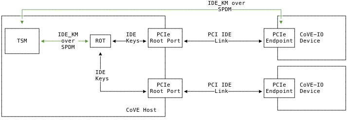

[[theory_operations]]

== Theory of Operations

The CoVE-IO specification extends the CoVE host and guest SBI extensions to
allow TVMs to establish trust with TEE-IO devices, and then use and interact
with those devices. Untrusted supervisor domain components are responsible for
assigning TEE-IO devices to TVMs, and also for supporting the TVM acceptance or
rejection of the assigned devices. The TSM, on the other hand, establishes and
maintains the secure physical and logical links between TVMs and their assigned
devices.

The following sections describe the functionality of the TSM-provided CoVE-IO
extensions to support trusted I/O on CoVE-enabled platforms.

=== Platform Initialization

==== IOMMU Registration and Setup

The TSM relies on the availability of at least one IOMMU instance exclusvely
associated with the TSM supervisor domain. Those IOMMUs allow the TSM to enforce
the integrity of address translations and protection from DMA into confidential
memory, as well as  interrupts originating from assigned TDIs. The host
supervisor domain may assign one or more IOMMU instances to the TSM supervisor
domain, after which, only the TSM can access and program the assigned IOMMU
instances.

IOMMUs assigned to the TSM security domain may generate MSIs in order to signal
the TSM about command completions, transaction faults or device page requests.
Those MSIs target system physical memory, which is owned by the host security
domain manager, e.g. the host VMM. As a consequence, it is the host security
domain's responsibility to reserve the MSI addresses and then rely on the TSM to
program the IOMMUs with those reserved addresses. This IOMMU registration
process is driven by the untrusted domain manager for all IOMMUs that
participate in TEE-IO and operates as described in the following steps:

1. The TSM is loaded into a supervisor domain and provisioned with a CoVE-IO
   manifest. It is recommended that the TSM is measured by the root-of-trust for
   measurement (RTM) for subsequent attestation.
2. The host supervisor domain manager (e.g. the host VMM) enumerates all
   platform IOMMUs as PCIe devices.
3. The host IOMMU driver is loaded and probed.
4. The host IOMMU driver allocates MSI vectors for the trusted domain
   IOMMUs. Those vectors must point to the untrusted IOMMU driver as the TSM can
   not handle external interrupts.
5. The host supervisor domain manager registers the IOMMUs with the TSM by
   calling the `sbi_covh_register_iommu()` `COVH` function. The TSM gets the
   allocated MSI vectors and configures the trusted IOMMU `s_msi_cfg_table`
   register accordingly.
6. When a trusted IOMMU sends an MSI, the untrusted IOMMU driver handles it and
   notifies the TSM about a pending trusted IOMMU MSI by calling the
   `sbi_covh_notify_iommu_msi()` `COVH` function.
7. The TSM verifies that there is a pending MSI by reading the IOMMU `s_ipsr`
   register, and handles the interrupts as needed.

The host IOMMU driver may be malicious and attempt to trick the TSM by either
invoking the `sbi_covh_notify_iommu_msi()` `COVH` function while there are no
pending MSI from the trusted IOMMU or not invoking it when there actually is one
such pending interrupt. In the former case, the TSM can verify that there really
is a pending MSI by checking the trusted IOMMU status registers. The latter case
could cause a denial of service, which is not in scope of the confidential
computing threat model. If the TSM must ensure that a given command is completed
without having to rely on untrusted IOMMU driver MSI notifications, it can queue
an `IOFENCE.C` command after the desired command and check for the `cqh`
advancing past the `IOFENCE.C` command index.

==== PCIe Root Port Registration

When the data link between the TDI and the TVM must be secured, trusted I/O
relies on the PCIe IDE protocol. IDE provides confidentiality and integrity
protection for TLPs received and transmitted between the physical device the TDI
belongs to and its assigned PCIe root port (RP). Both endpoints (The RP and the
physical device) must be configured with the same encryption keys through the
IDE key management protocols and have their IDE PCIe extended capability
configured as well.

As described in the threat model and requirement sections, the following trusted
I/O rules apply:

* As PCIe switches are outside of the TVM TCB, only selective IDE streams are
  used to protect the PCIe link between the TVM and the TDI.
* A single selective IDE stream is established between the physical device and
  its Root Port. All TDIs from the physical device share this single IDE stream.
* For each physical device from which a TDI is attached to a TVM, the TSM
  generates, owns and distributes the IDE stream keys to both the physical
  device and the RP.
* The TSM configures the RP PCIe IDE extended capability.

As the TSM is responsible for setting both the RP IDE keys and PCI IDE
capabilities, it must be the IDE operations owner for any downstream device for
a given RP. As the overall platform resources owner, the host supervisor domain
software stack must register a RP for TEE I/O and IDE ownership with the TSM, by
calling the `sbi_covh_register_rp()` `COVH` function. This function associates a
RP id to its MMIO space (for the IDE capability configurations) and all the MMIO
ranges that are routed through it. The TSM must compare these 2 arguments with
the information it received from the platform ROT through the TEE I/O manifest.
If both match, it can proceed into establishing an SPDM session with the RP.

===== Root-of-Trust SPDM Session

For each TDI that gets attached to a TVM, its corresponding PCIe root port must
be configured with per-device IDE keys. This configuration is done through the
PCIe IDE key management protocol (IDE_KM) that runs on top of an SPDM session.
It is thus necessary to establish an SPDM session with all trusted I/O
registered root ports. This is akin to considering the RP as just another
trusted device for which the DSM is the platform ROT. The SPDM establishment
thus happens between the TSM and the platform ROT. By having the ROT playing the
RP DSM role, the RP vendor-specific IDE key management interface is abstracted
by the ROT.

[[IDE_KM_RPT_OP]]
.PCIe Root Port IDE Key Management through Hardware Root-of-Trust

// After the host supervisor domain manager successfully registers a root port with
// the TSM, it requests the TSM to establish a secured SPDM session (together with
// the IDE stream setup) with it by calling the `COVH` `sbi_covh_connect_device()`
// function. The same function is used for establishing SPDM sessions with PCIe
// root ports and physical devices acting as SPDM responders. The Secured SPDM
// Session section describes the protocol followed by the TSM and the SPDM
// responder to establish this secured session.

=== SPDM Transport

SPDM is the main transport protocol for securely setting both the RP and the
physical device IDE keys and also for driving the TDI through the TDISP state
machine.

[[spdm_message]]
.SPDM Message Layout
image::images/SPDM_session.svg[align="center"]

Whether the SPDM session is established with the ROT or the physical device, the
TSM is the requester and it must reach and communicate with DOE mailboxes that
are owned by the host supervisor domain manager. As a consequence, after
requesting the TSM to establish an SPDM session with a device (through the
`sbi_covh_connect_device()` `COVH` call), it acts as an untrusted SPDM messages
proxy between the TSM and the device DSM.

After a successful call to `sbi_covh_connect_device()`, host supervisor domain
initiated CoVE-IO `COVH` calls that require SPDM requests to be sent to the device
DOE mailbox follows the flow described below:

.SPDM Flow With CoVE
[source,mermaid]
....
%%{init: {'theme': 'neutral', 'themeVariables': {'darkMode': true}, "flowchart" : { "curve" : "basis" } } }%%
sequenceDiagram

autonumber

participant Responder as Device or ROT (SPDM Responder)
participant VMM as Host Supervisor Domain Manager (VMM)
participant TSM

VMM ->> TSM: [COVH] - sbi_covh_tee_io_action()
TSM ->> TSM: Generate SPDM request REQ_1
TSM ->> VMM: [COVH] - SBI_SUCCESS(SPDM_PENDING_REQUEST REQ_1)
VMM ->> Responder: [DOE] - SPDM_REQ_1
Responder ->> VMM: [DOE] - SPDM_RESP_1
VMM ->> TSM: [COVH] - sbi_covh_tee_io_action(RESP_1)
TSM ->> TSM: Generate SPDM request REQ_2
TSM ->> VMM: [COVH] - SBI_SUCCESS(SPDM_PENDING_REQUEST REQ_2)
VMM ->> Responder: [DOE] - SPDM_REQ_2
Responder ->> VMM: [DOE] - SPDM_RESP_2
VMM ->> TSM: [COVH] - sbi_covh_tee_io_action(RESP_2)
TSM ->> VMM: [COVH] - SBI_ERROR_CODE(SPDM_REQUEST_COMPLETED)
....

The TSM generates the SPDM request to support the initial CoVE-IO `COVH` call and
copies the request into the per-vcpu shared, non-confidential memory region that
the host supervisor domain and the TSM share as per the CoVE specification. The
TSM replies to the host supervisor domain manager request with the `SBI_SUCCESS`
error code and the `SPDM_PENDING_REQUEST (0x1)` value through the `sbiret`
structure. The host supervisor domain manager then sends the pending SPDM
request to the device DOE mailbox. It forwards the device SPDM response to the
TSM, by copying it to the same SPDM buffer it fetches the SPDM request from and
by calling again the same CoVE-IO `COVH` call.
This process continues until the initial CoVE-IO call is completed. The TSM then
replies to the last `COVH` call with the appropriate error code and the
`SPDM_REQUEST_COMPLETED (0x0)` value through the `sbiret` structure.

The TSM only supports one pending SPDM transaction per device, and the CoVE NACL
shared memory holds one pending SPDM action buffer per device the TSM is
connected to. Each pending SPDM action buffer is structured as described in the
following layout:

.Pending SPDM Transaction Buffer Layout
[options="header"]
|===
| Offset (bytes) | Field | Length (bytes) | Description

| `0h`  | `FUNCTION_ID` | 4 | The SBI Function ID this pending SPDM transaction
                              applies to.
| `4h`  | `DEVICE_ID`   | 4 | The PCIe device ID this pending SPDM transaction
                              applies to.
| `8h`  | `SPDM_PAYLOAD_LENGTH` | 4                         | SPDM payload length.
| `12h` | `SPDM_PAYLOAD`        | See `SPDM_PAYLOAD_LENGTH` | SPDM payload data
                                                              (e.g. TDISP, IDE_KM).
|===

In this document, for readability reasons, flow definitions that involve SPDM
based exchanges are simplified and do not include the above described flow
between the TSM, the host supervisor domain manager and the SPDM responder. In
particular, the steps that cover the SPDM request generation from the TSM, the
transmission to the host VMM, the transmission to the SPDM responder and finally
the path back to the TSM are reduced into 2 steps:

1. TSM sends SPDM request #1
2. TSM receives SPDM response #1

For example the above example would be described through those simplified steps:

1. VMM calls `sbi_covh_tee_io_action()`
2. TSM sends SPDM request #1
3. TSM receives SPDM response #1
4. TSM sends SPDM request #2
5. TSM receives SPDM response #2
6. TSM returns `sbi_covh_tee_io_action()`

==== Secure SPDM Session

With trusted I/O, the TSM establishes SPDM sessions with both the ROT and the
physical devices DSMs. As those sessions are used to exchange IDE keys through
the `IDE_KM` protocol while going through the host supervisor domain manager,
they need to be confidentiality and integrity protected. Establishing a secured
SPDM session for IDE key management or TDISP operations between the TSM and
either PCIe root ports or devices is a mandatory requirement for TVMs to accept
TDIs into their TCB.

Any trusted I/O SPDM session is established through the SPDM responder DOE
mailbox, which could be either the ROT acting as a DSM for the PCIe root ports,
or the physical device DSM. In either case the mailboxes are resources owned by
the host security domain manager which thus initiates the SPDM session
establishment. It acts as an untrusted proxy between the TSM and the DSM by
requesting the TSM to generate SPDM requests through the CoVIO `COVH`TH ABI,
sending those requests to the DOE mailbox and forwarding the SPDM responses back
to the TSM, as described in the SPDM flow section.

=== Device Initialization

After the IOMMU is registered with the TSM, the host supervisor domain manager
must cooperate with the TSM to properly initialize any device from which a TDI
could be assigned to a TVM.

The device initialization process aims at establishing secured,
integrity-protected control and data planes between the TSM and the
DSM running in either the platform ROT or a physical PCIe device.
The secured control plane is based on the SPDM protocol and is an encrypted,
integrity-protected software session that is used for passing TDISP and IDE_KM
messages between the TSM and the DSM.
The data place is a hardware session based on the PCIe Integrity and Data
Encryption (IDE) specification and is used to secure the PCIe TLPs.

When the host supervisor domain detects a new TEE-IO capable device, it must go
through two device initialization steps:

1. Establish a secured SPDM session between the TSM (The SPDM Requester) and the
   device DSM (The SPDM responder).
2. Set the PCIe IDE stream up for encrypting the PCIe link.

The CoVE-IO `COVH` extension supports those two initialization steps through one
single function: `sbi_covh_connect_device()`.

When the host supervisor domain manager calls `sbi_covh_connect_device()`, it
requests the TSM to establish an SPDM session with a device, and to set an PCIe
IDE link between the device and the TSM.

==== SPDM Session

The first step for initializing a TEE-IO capable device is to establish a
secured SPDM session between the TSM an the device. The secured SPDM sessions
will then be used to carry `TDISP` and `IDE_KM` messages, in order to
respectively secure the physical link between the device and its PCIe root port,
and for assigning or unassigning TDIs from a TVM.

The host supervisor domain manager requires the TSM to establish a secured SPDM
session with the physical device by calling the `sbi_covh_connect_device()`
COVH function. Before proceeding into actually establishing the session, the TSM
must check that:

1. The physical device is a downstream endpoint of a root port that
   the host supervisor domain manager has previously registered with the TSM.
2. A secured SPDM session between the TSM and the upstream root port is
   established.

The TSM establishes a secured SPDM session with the physical device DSM by going
through the steps described in the Secured SPDM Session section.

==== IDE Link

The SPDM session is a software link between the TSM and the DSM, secured after
both entities go through a DHE key exchange over the untrusted host supervisor
domain manager proxy. SPDM is used as a control link for configuring the rest of
the device and then running the TDI assignment flows.

The last part of the device initialization is about securing the data link
between the TSM and the device, and that must be done through the IDE Key
Management protocol.
Here again, the host supervisor domain manager initiates the PCI IDE link setup
by calling the `sbi_covh_connect_device` COVH function, and relies on the TSM to
generate and send IDE KM messages over SPDM.

The TSM is responsible for:
1. Configuring the PCIe root port IDE Extended Capability.
2. Generating the IDE keys for all sub-streams for a given stream ID.
3. Setting the PCIe root port IDE keys for a given stream ID, through IDE KM
   requests.
4. Refreshing the PCIe root port IDE keys for a given stream ID.
5. Generating all IDE KM requests and encapsulating them into SPDM messages.
6. Setting the PCIe device IDE keys through IDE KM requests.

The host VMM is responsible for:
1. Generating and managing system wide PCIe stream IDs.
2. Setting the device PCIe device IDE PCI Extended Capability.
3. Programing the PCIe switch between the device and PCIe root port, such as
   IDE Control Register - Flow-Through IDE Stream Enabled.
4. Initiating the IDE link setup.

The IDE link initial setup must go through the following steps:

1. The host supervisor domain manager finds an available stream ID and
   configures the device IDE Extended Capability accordingly.
2. The host supervisor domain manager programs the device IDE extended
   capability: All RIDs and all memory is allowed, IDE is enabled.
3. The host supervisor domain manager initiates the IDE link setup by calling
   the `sbi_covh_connect_device` COVH function.
4. The TSM programs the Root Port IDE Extended Capability with the proper RID
   range and the stream ID selected by the host supervisor domain manager in
   step 1. The capability is only accessible to the TSM, i.e. any writes to it
   with the C-bit set to 0 are dropped and reads return all 1s.
5. The TSM generates an IDE key for each sub-stream for the stream ID.
6. The TSM, for each Rx and Tx sub-stream (6 of them), programs the generated
   keys into the physical device:
   a. Generates and sends an `IDE_KM KEY_PROG` message to the DSM. The message
      is encapsulated in a vendor-defined SPDM request.
   b. Receives an `IDE_KM_KEY KP_ACK` from the DSM.
7. The TSM, for each Rx and Tx sub-stream (6 of them), programs the generated
   keys into the physical device’s PCIe root port:
   a. Generates and sends an `IDE_KM KEY_PROG` message to the ROT. The message
      is encapsulated into a vendor-defined SPDM request.
   b. Receives an `IDE_KM_KEY KP_ACK` from the ROT.
8. The TSM, for each Rx sub-stream (3 of them), triggers IDE in the physical
   device:
   a. Generates and sends an `IDE_KM SET_GO(Rx)` message to the DSM. The message
      is encapsulated into a vendor-defined SPDM request.
   b. Receives an `IDE_KM_KEY K_GOSTOP_ACK` from the DSM.
9. The TSM, for each Rx sub-stream (3 of them), triggers IDE in the physical
   device’s PCIe root port:
   a. Generates and sends an `IDE_KM SET_GO(Rx)` message to the ROT. The message
      is encapsulated into a vendor-defined SPDM request.
   b. Receives an `IDE_KM_KEY K_GOSTOP_ACK` from the ROT.
10. The TSM, for each Tx sub-stream (3 of them), triggers IDE in the physical
    device:
   a. Generates and sends an `IDE_KM SET_GO(Tx)` message to the DSM. The message
      is encapsulated into a vendor-defined SPDM request.
   b. Receives an `IDE_KM_KEY K_GOSTOP_ACK` from the DSM.
11. The TSM, for each Tx sub-stream (3 of them), triggers IDE in the physical
    device’s PCIe root port:
    a. Generates and sends an `IDE_KM SET_GO(Tx)` message to the ROT. The
        message is encapsulated into a vendor-defined SPDM request.
    b. Receives an `IDE_KM_KEY K_GOSTOP_ACK` from the DSM.

.Device Connection
[source,mermaid]
....
%%{init: {'theme': 'neutral', 'themeVariables': {'darkMode': true}, "flowchart" : { "curve" : "basis" } } }%%
sequenceDiagram

autonumber

participant DSM as Device DSM or ROT
participant VMM as Host Supervisor Domain Manager (VMM)
participant TSM

VMM ->> TSM: [COVH] - sbi_covh_connect_device()

Note over TSM,DSM: TSM: SPDM Connection Setup

TSM ->> TSM: Generate SPDM request: GET_VERSION
TSM ->> VMM: [COVH] - spdm_req(GET_VERSION)
VMM ->> DSM: [DOE] - SPDM_GET_VERSION
DSM ->> VMM: [DOE] - SPDM_VERSION
VMM ->> TSM: [COVH] - spdm_resp(VERSION)

TSM ->> TSM: Generate SPDM request: GET_CAPABILITIES
TSM ->> VMM: [COVH] - spdm_req(GET_CAPABILITIES)
VMM ->> DSM: [DOE] - SPDM_GET_CAPABILITIES
DSM ->> VMM: [DOE] - CAPABILITIES
VMM ->> TSM: [COVH] - spdm_resp(CAPABILITIES)

TSM ->> TSM: Generate SPDM request: NEGOTIATE_ALGORITHMS
TSM ->> VMM: [COVH] - spdm_req(NEGOTIATE_ALGORITHMS)
VMM ->> DSM: [DOE] - SPDM_NEGOTIATE_ALGORITHMS
DSM ->> VMM: [DOE] - ALGORITHMS
VMM ->> TSM: [COVH] - spdm_resp(ALGORITHMS)

TSM ->> TSM: Generate SPDM request: GET_CERTIFICATE
TSM ->> VMM: [COVH] - spdm_req(GET_CERTIFICATE)
VMM ->> DSM: [DOE] - GET_CERTIFICATE
DSM ->> VMM: [DOE] - CERTIFICATE
VMM ->> TSM: [COVH] - spdm_resp(CERTIFICATE)
TSM ->> TSM: Verify and store device certificate chain

Note over TSM,DSM: TSM: SPDM Key Exchange

TSM ->> TSM: Generate ephemeral SPDM keys K0
TSM ->> TSM: Generate SPDM request: KEY_EXCHANGE(K0)
TSM ->> VMM: [COVH] - spdm_req(KEY_EXCHANGE)
VMM ->> DSM: [DOE] - SPDM_KEY_EXCHANGE
DSM ->> VMM: [DOE] - KEY_EXCHANGE_RSP
VMM ->> TSM: [COVH] - spdm_resp(KEY_EXCHANGE_RSP)
TSM ->> TSM: Derive DHE secret
TSM ->> TSM: Generate SPDM request: FINISH
TSM ->> VMM: [COVH] - spdm_req(FINISH)
VMM ->> DSM: [DOE] - SPDM_FINISH
DSM ->> VMM: [DOE] - FINISH_RSP
VMM ->> TSM: [COVH] - spdm_resp(FINISH_RSP)

Note over TSM,DSM: TSM: SPDM Session Created

%% TODO Add the IDE sequence...
Note over TSM,DSM: IDE Link setup starts here...

TSM ->> VMM: [COVH] - spdm_covh_connect_device()

....

=== Interface Assignment

Once both the SPDM session and the IDE link are secured and established, the
host supervisor domain manager may directly assign a TDI to a TVM, through the
`COVH` interface. This is a four steps process:

1. The host supervisor domain manager initiates the interface assignment flow by
   having the TSM move the TDI into the TDISP `CONFIG_LOCKED` state.
2. The TVM verifies and accepts the locked TDI into its TCB.
3. The TVM asks the TSM to move the TDI to the TDISP `RUN` state.
4. The TVM verifies that the TDI is in the TDISP `RUN` state and starts
   using it.

The next section describe in more details what step 2 covers, i.e. which steps
a TVM should follow in order to be able to verify a locked TDI and accept or
reject it into its TCB.

==== TDI Acceptation

It is the TVM responsibility to accept or reject the assigned TDI into its
TCB, and to explicitly notify both the TSM and the host supervisor domain
manager about its decision. The TVM should check for the following security
attributes before being able to decide whether or not it can safely add a TDI
into its TCB:

1. **SPDM session establishment**: A secured SPDM session must be established
   between the TDI’s DSM and the TSM. TVM verifies that attribute from the TSM,
   through the `sbi_covg_get_device_link()` `COVG` ABI.
2. **IDE link**: The PCIe physical link between the Root Port and the physical
   device must be confidentiality and integrity protected through IDE. As for
   the SPDM session, the TVM calls into the `sbi_covg_get_device_link()` `COVG`
   ABI to verify that attribute from the TSM.
3. **TDISP and SPDM configuration**: The TVM must verify that the TDI TDISP
   configuration and the SPDM session attributes comply with its security policy.
   For example, the TVM could check for the allowed device firmware update
   policy by combining the TDI TDISP report `NO_FW_UPDATE` setting with the SPDM
   session measurement freshness capabilities (`MEAS_FRESH_CAP`). It is then the
   TVM choice to accept or reject a TDI depending on the inferred physical
   device firmware update policy. The TDI interface report and the SPDM session
   attributes are provided by respectively the `sbi_covg_get_interface_report()`
   and the `sbi_covg_get_device_spdm_attrs()` `COVG` ABI.
4. **TDI state**: Before accepting a TDI into its TCB, a TVM must verify that
   its configuration is immutable, and in particular that the host can not
   modify it without having all in-flight transactions being discarded. TEE-IO
   capable physical devices follow the TDISP specification and can guarantee
   that immutability state once the TDI has been moved to the TDISP
   `CONFIG_LOCKED` state. The transition from TDISP `CONFIG_UNLOCKED` to
   `CONFIG_LOCKED` is triggered by the host supervisor domain manager through
   the `COVH` ABI. As such, the TVM can query the TSM for the TDI state through
   the `sbi_covg_get_interface_state()` `COVG` ABI. A TVM must not accept a TDI
   if it’s in any other TDISP state than `CONFIG_LOCKED`.
5. **Device trustworthiness**: Verifying that the TDI is in an immutable state
   across a secured SPDM and physical link is mandatory but not sufficient. The
   TVM must also attest to the physical device trustworthiness in order to
   decide if it can accept one of its TDIs into its TCB. A TVM can trust a PCIe
   device by first authentictating it. Once authenticated, the TVM challenges
   the device and then verifies its measurements:
   a. First the TVM must first verify the authenticity of the device by getting
      its certificate chain from the TSM, through the
      `sbi_covg_get_device_certificate()` `COVG` ABI. The TVM should then verify
      the chain against a provisioned and measured trust anchor list.
   b. Once the device certificate authenticity is verified, the TVM must then
      challenge it by having it sign a piece of data, making sure that the
      device actually owns the private key bound to its certificate. This is
      achieved by getting the TDI measurements from the TSM through the
      `sbi_covg_get_device_measurement()` `COVG` ABI. This set of device-signed
      measurements, also knonw as the device attestation evidence, must be
      verified against the TDI certificate acquired in the previous step.
   c. Finally, the TVM should attest to the device configuration trustworthiness
      (code, SVN, state, etc) by verifying the previously fetched device
      attestation evidence. This is typically done through a remote or local
      attestation procedure.
6. **TDI IO ranges**: The TVM will likely interact with and program the TDI
   through a set of memory mapped IO ranges (e.g. a PCI BAR defined memory
   range). However, when discovering the TDI in its address space, the TVM only
   sees guest physical addresses (GPA) for those ranges, as exposed by the
   host supervisor domain manager  PCI emulation. When communicating with the
   TDI, the TVM will use those GPAs and must rely on their corresponding
   translations to host physical addresses (HPA) to be properly set. In
   particular, it must rely on the fact that the TDI MMIO ranges GPAs do not map
   to non-confidential memory that could be otherwise accessed by a host domain
   component. To verify that security attribute, the TVM must retrieve the TDISP
   report for the TDI, through the `sbi_covg_get_interface_report()`. The TDISP
   report, among other things, contains the list of MMIO ranges for the TDI
   sorted by BAR indexes. First, the TVM must verify that the host VMM exposed
   BARs have the same sizes as the TDISP reported ones. To further validate
   those ranges, the TVM must check from the TSM that they’re correctly mapped
   to host physical ranges. Prior to the TVM being able to accept a TDI, the
   host VMM must have requested the TSM to map all the TDI MMIO ranges to TVM
   GPA ranges, through `sbi_covh_add_tvm_region()` `COVH` calls. The TVM then
   verifies from the TSM that a GPA exposed TDI MMIO range will be mapped to
   the TDISP reported range through the TSM managed G-stage page tables, by
   calling into the `sbi_covg_map_interface_mmio()` `COVG` ABI. The TVM can
   accept a TDI only if the TSM confirms the validity of all MMIO range
   mappings, in the TDISP reported order (i.e. BAR #N in the TVM address space
   will be mapped to the TDISP reported MMIO range #N).

Once the TVM has verified the above security attributes, it lets the TSM and the
TVM know that it is ready to use the TDI, by calling into the
`sbi_covg_run_interface()` `COVG` ABI.

=== Interface Unassignment
