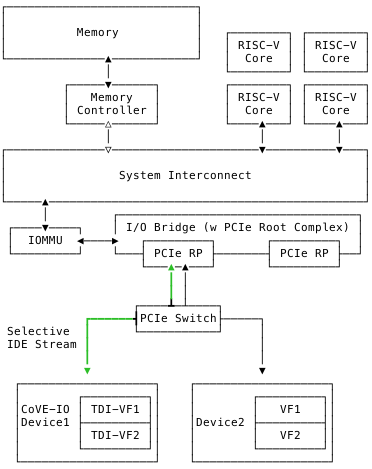

[[requirements]]
== Requirements

In order to extend TVM TCBs with external and untrusted devices, both the host
platform and the assigned devices must meet a specific set of requirements.

=== Device

CoVE-IO compliant implementations support extending TVMs TCBs with devices if
and only if they meet the following requirements:

==== PCIe or CXL.io

A CoVE-IO supported device must be a PCIe or CXL.io compliant device with
optional SR-IOV capabilities. When supporting SR-IOV, the device can be split
into multiple Virtual Functions (VFs). A TVM-assigned interface can be the whole
device, also known as the Physical Device (PF), or any of its VFs. In both
cases, this unit of assignment is referred to as a TEE I/O Device Interface
(TDI).

A host enumerated TDI must provide the following PCIe capabilities:

===== TEE Device Interface Protocol (TDISP)

In order to interoperate with a RISC-V CoVE-IO implementation, PCIe devices must
support the <<TDISP>> protocol version 1.0 or above, as defined in the latest
TDISP ECN. CoVE-IO devices must support all required TDISP requests and may
support the optional ones, as defined by the TDISP request code table.

Moreover, CoVE-IO compatible device firmwares must run a Device Security Manager
(DSM) to enforce the TDISP-defined security attributes and policies.
The DSM must support both full PCIe devices (PFs) and Virtual Functions (VFs)
assignment to TVMs.

====== Enumeration

TDIs PCIe Device Capabilities Registers must have the "TEE-IO Supported" bit in
"Device Capabilities Register" set in order for the host to discover their TDISP
capability.

===== Data Object Exchange (DOE)

The TDI implements the optional PCIe Data Object Exchange mechanism. The minimal
supported version is 1.0 defined in <<PCIE>>.

A CoVE-IO supported device must support the following DOE object types:

|===
| Vendor ID | Object Type | Description

| 0001 | 00 | DOE Discovery
| 0001 | 01 | CMA/SPDM
| 0001 | 02 | Secure CMA/SPDM
|===

====== Secure Protocol and Data Model (SPDM)

RISC-V CoVE-IO compliant hosts use the Security Protocol and Data Model (<<SPDM>>)
protocol to exchange TDISP and IDE Key Management (IDE_KM) messages with
physical devices, over DOE mailboxes. CoVE-IO also relies on SPDM for
gathering devices' certificates and measurements.

As a consequence, a CoVE-IO supported DSM must support the SPDM specification
version 1.2 or above. It must also support sending and receiving SPDM Secured
Messages as defined in the <<SecuredSPDM>> specification version 1.1 or above.

CoVE-IO compatible DSMs must support the following SPDM responder capabilities:
`CERT_CAP`, `MEAS_CAP` (10b), `ENCRYPT_CAP`, `MAC_CAP`, and `KEY_EX_CAP`.

Moreover, CoVE-IO compatible DSMs must support below algorithms:

1. For `BaseHashAlgo`, one or more of the following ones: `TPM_ALG_SHA_256`,
   `TPM_ALG_SHA_384`.
2. For `MeasurementHashAlgo`, one or more of the following ones:
   `TPM_ALG_SHA_256`, `TPM_ALG_SHA_384`.
3. For `AEAD` Cipher Suite, `AES-256-GCM` with 16 byte MAC.

CoVE-IO compatible DSMs must support below traditional algorithms:

1. For `BaseAsymAlgo`, one or more of the following ones: `TPM_ALG_RSASSA_3072`,
   `TPM_ALG_ECDSA_ECC_NIST_P256`, `TPM_ALG_ECDSA_ECC_NIST_P384`.
2. For `DHE Group`, one or more of the following ones: `secp256r1`, `secp384r1`.

If CoVE-IO compatible DSMs support SPDM version 1.4 or above, it must support
below PQC algorithms:

1. For `PqcAsymAlgo`, `ML-DSA-87`.
2. For `KEMAlg`, `ML-KEM-1024`.

CoVE-IO compatible DSMs may support following combinations during PQC transition phase:

1. Both traditional algorithms and PQC algorithms
2. Traditional algorithms only
3. PQC algorithms only

===== Integrity and Data Exchange (IDE)

The data that flows between a TDI and a TVM must be confidential and both
integrity and replay attack protected. PCIe IDE provides this protection for all
Transport Layer Packets (TLPs) moving between those two endpoints. As a
consequence, CoVE-IO compatible devices must implement IDE and expose this PCIe
capability defined in <<PCIE>>.

====== Selective Streams

As all PCIe switches are excluded from a TVM's TCB, CoVE-IO compliant hosts'
TSMs exclusively establish selective IDE streams between the host PCIe Root Port
and TEE-IO devices.

====== Key Management

To fully support IDE, CoVE-IO compatible devices must implement the IDE Key
Management (IDE_KM) protocol. IDE_KM messages are initiated by the TSM and sent
over SPDM to the DSM.

CoVE-IO compatible devices must keep track of the IDE key invocation field,
which is in bit 63:0 of the IDE sub-stream specific AES-GCM initialization
vector (IV). If the IDE key invocation field overflows, the IDE stream must
enter Insecure state. Before overflowing, the device may notify the host to let
the host software perform the IDE_KM defined key refresh process.

=== Host

In order to support TEE-IO devices with the above described capabilities, a
CoVE implementation must meet software and hardware requirements, as described
in the next sections.

==== Ownership

In a CoVE-IO context, the hosting Supervisor Domain manager is the sole platform
resource's owner. In particular, the physical devices to which TDIs belong are
owned and managed by the host, typically through the device PF. Host software
stack components, e.g. the VMM, assign, unassign, and expose TDIs resp. to,
from, and to TVMs.

==== Platform Hardware Components

===== PCIe

All CoVE-IO-compliant devices in a CoVE platform must be connected to the CoVE
platform through a PCIe Root Port (RP) that is part of a PCIe Root Complex (RC).

A CoVE-IO PCIe link can be direct or go via any topology or PCIe switches and
bridges. Since those are excluded from a TVM's TCB, only selective IDE streams
must be used between a CoVE-IO device and its corresponding PCIe Root Port.

The TSM establishes one single selective IDE stream for each physical device
from which TDIs may be attached to TVMs. All TDIs within a CoVE-IO device share
the same IDE stream.

For a given selective IDE stream, the TSM generates, owns, and distributes the
IDE keys to both the CoVE-IO device and its upstream PCIe Root Port.

[[coveio_hierarchy]]
.CoVE-IO PCIe Topology

===== IO Translation Agent

CoVE-IO-compliant platforms must have at least one IO translation agent, also
known as an IOMMU. Platform IOMMUs must follow the RISC-V <<IOMMU>> architecture
specification v1.0.

In order to protect direct access to confidential memory, a CoVE-IO device must
be attached to a PCIe Root Port that is bound to a platform IOMMU. All inbound
traffic from a TDI must then be translated by the upstream IOMMU.

As Supervisor Domain Security Managers (SDSM), TSMs are responsible for
setting TDI-specific DMA mappings, MSI page tables, and also for configuring
platform IOMMUs own MSIs. As a consequence, IOMMU instances on a CoVE-IO
platform may be directly and exclusively tied to a TSM controlled supervisor
domain, allowing the TSM to manage address translation and protection for DMA
that originates from devices under its control.

Each IOMMU offers a memory-mapped Register Programming Interface (RPI) that the
associated TSM uses to configure and control the IOMMU. The RDSM, through the
<<Smmmtt>> extension, enforces that this interface is access-restricted to the
TSM the IOMMU is assigned to. This guarantees that a TSM currently running on a
RISC-V hart has exclusive access to the physical address of its IOMMU RPI.

On platforms supporting the MTT and IO-MTT <<Smmtt>> extensions, any PCIe device
(regardless of its TEE-IO compliance) can be assigned to any Supervisor Domain,
as long as this domain has RDSM-enforced exclusive access to an IOMMU instance
RPI.

===== CoVE-IO Manifest

The TSM must be provisioned with a trusted piece of data describing the required
CoVE-IO platform components. The Root-of-Trust provides the TSM with a CoVE-IO
manifest containing the following pieces of information:

Trust anchor:: A list of root certificates that the TSM uses to verify DSM
certificates received through SPDM.

IOMMUs:: For each IOMMU present in the platform:
* The IOMMU RPI MMIO base address. This is used as the IOMMU identifier.

PCIe Root Ports:: For each PCIe Root Ports present in the platform:
* A PCIe Segment:Bus:Device:Function identifier.
* The IOMMU identifier the RP is bound to.
* The list of all MMIO ranges routed throught that RP.
* The RP ECAM base address.
* All downstream PCIe Endpoints linked to that RP, identified by their PCIe RID
(i.e. the device PCIe Bus:Device:Function triplet).

TODO: More precise CoVE-IO manifest format.

==== Software

===== Host

To support extending TVMs with CoVE-IO devices, the untrusted domain software
stack must:

* Implement the <<CoVE>> Host Extension (`COVH`).
* Support the RISC-V <<IOMMU>> programming interface with an IOMMU driver.
* Implement the CoVE-IO host ABI, as described in Chapter 8 of this document.

===== TSM

The trusted Domain Security Manager, i.e. the TSM, is the trusted intermediary
between the untrusted domain and the TVM. To allow for securely assigning TDIs
into TVMs, it must:

* Support the <<CoVE>> Host Extension (`COVH`).
* Implement the <<CoVE>> Guest Extension (`COVH` and `COVG`).
* Support the RISC-V <<IOMMU>> programming interface with an IOMMU driver.
* Support the CoVE-IO host ABI, as described in Chapter 8 of this document:
  ** Implement the SPDM requester protocol and flows.
  ** Implement the TDISP requester protocol and flows.
  ** Implement the PCIe IDE Key Management protocol.
* Implement the CoVE-IO guest ABI, as described in Chapter 8 of this document.

=== Guest

A TVM guest must verify and explictly accept any TDI into their TCBs. The TSM
prevents TDIs from directly accessing the TVM confidential memory and prevents
the TVM from doing memory mapped I/O with TDIs, unless the TVM guest accepts
the TDI.

By implementing the CoVE-IO guest ABI, the TSM allows for a TVM guest to verify
the trustworthiness of an assigned TDI. The TVM also uses the same ABI to notify
the TSM about its TDI acceptance decision.

The TDI verification process from the TVM guest not only requires support from
the TSM through the CoVE-IO guest ABI but may also include running local or
remote attestation of the physical device the assigned TDI belongs to.
In order to minimize the TVM guest software stack changes needed to support the
CoVE-IO TDI verification, attestation, and acceptance flows, the CoVE-IO guest
must run a Trusted Device Manager (TDM) as a separate TVM guest process.
Although the TDM can be architectured in a TEE-agnostic fashion, it must support
the CoVE-IO guest ABI.
