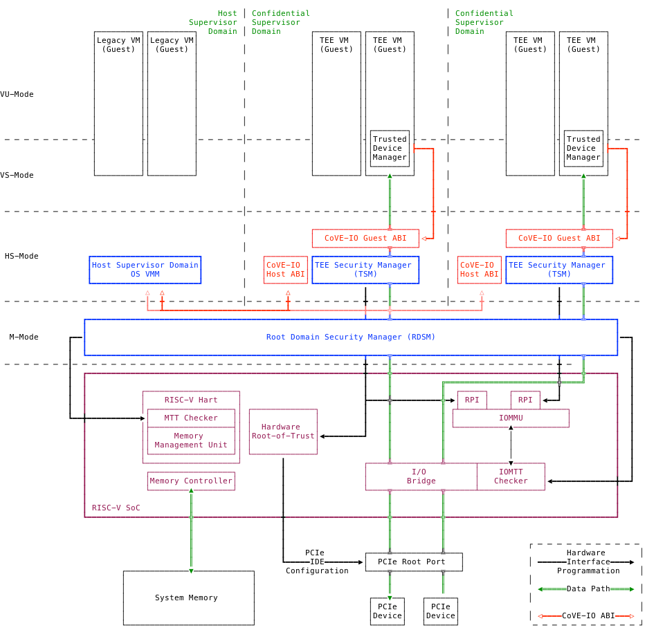

[[arch_overview]]
== Architectural Overview

CoVE-IO is made of multiple hardware and software components.

Figure 1 below illustrates the overall CoVE-IO architectural components and how
they interact together:

[[COVE_IO_ARCHITECTURE]]
.CoVE-IO High Level Architecture

The TEE Security Manager (TSM) orchestrates and manages TEE Virtual Machines
(TVM), as defined by the <<CoVE>> specification. The TSM operates in HS-Mode
and is the confidential Supervisor Domain manager. It uses the <<Smmtt>>
specified Memory Tracking Table (MTT) to enforce TVM memory isolation from
the host Supervisor Domain.

As the confidential Supervisor Domain manager, the TSM provides the `COVH` ABI
for the host OS/VMM to create and destroy TVMs, and donate or reclaim
confidential memory from them. TVMs can interact with the TSM through the
`COVG` ABI.

CoVE-IO extends both the `COVH` and `COVG` ABIs for bringing TEE-IO capable
devices into the trust boundary of TVMs. These extensions allow for configuring
and registering PCIe root ports and then binding physical devices interfaces
(TDI) and TVMs together.

With the CoVE-IO ABIs and flows, TDIs can access TVM confidential memory
directly through DMA. Based on the TVM configuration, the DMA accessible
confidential memory could be all TVM memory or a subset of the TVM memory. At
least one platform IOMMU instance must be exclusively tied to each supervisor
domains managing TVMs to which TDIs can be bound to. CoVE-IO uses the Smmtt MTT
and I/O MTT extensions, together with the IOMMU instance memory-mapped register
programming interface (`RPI` in figure 1) to grant TDIs with direct access to
their bound TVM confidential memory and isolate it from DMA originating from any
unbound TDI.

With the CoVE-IO model, the TVM ultimately holds the decision to accept or
reject a bound TDI into or from its TCB. Access to a TVM confidential memory
from a TDI is disabled until a TVM notifies the TSM that it trusts the TDI and
its configuration. The TVM communicates this decision after verifying the TDI,
which generally includes attesting to the physical device the TDI belongs to.
The device attestation process is specific to each TVM workload configuration,
but it may be handled by the Trusted Device Manager (TDM).

In order to protect the confidentiality and integrity of TVM data between the
PCIe root port and a bound TDI, PCIe IDE streams are established between them.
CoVE-IO relies on the TSM to generate and configure the IDE keys for both the
PCIe physical device and the PCIe root port the device is attached to. For
setting the device IDE keys up, the TSM must use the IDE Key Management
(`IDE_KM`) protocol. For the PCIe root port, the TSM must protect the IDE keys
exchange through e.g. a SPDM session with the platform Root-of-Trust (RoT) DOE
mailbox, when it supports that mechanism. If the communication between TSM and
the root port is protected by the platform, the TSM can program the IDE keys
into the root port directly.
