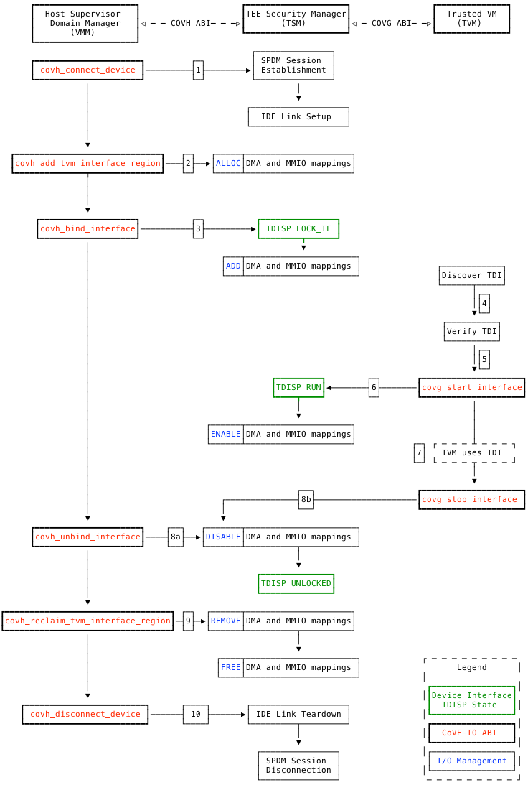

[[theory_operations]]

== Theory of Operations

The CoVE-IO specification extends the CoVE host and guest SBI extensions to
allow TVMs to establish trust with TEE-IO devices, and then use and interact
with those devices. Untrusted Supervisor Domain components are responsible for
assigning TEE-IO devices to TVMs, and also for supporting the TVM acceptance or
rejection of the assigned devices. The TSM, on the other hand, establishes and
maintains the secure physical and logical links between TVMs and their assigned
devices.

The following sections describe the functionality of the TSM-provided CoVE-IO
extensions to support trusted I/O on CoVE-enabled platforms.

=== Platform Management

==== IOMMU Assignment

For CoVE-IO, a TSM relies on being granted exclusive control over one IOMMU
instance on the platform. An IOMMU instance refers to any instantiation of a
RISC-V IOMMU Register Programming Interface (RPI), which could range from an
actual IOMMU instance to an MPT-enforced, memory-mapped access to a physically
partitioned IOMMU.

This exclusvely assigned IOMMU RPI allows the TSM to enforce the integrity of
address translations and protection from DMA into confidential memory, as well
as interrupts originating from TDIs assigned to TVMs under the TSM control.

When creating a Supervisor Domain (SD), the RDSM can optionally establish
exclusive access to an IOMMU RPI for the SD TSM, prior to loading and scheduling
said TSM. The RDSM creates <<Smmpt>> mappings to assign the IOMMU RPI to the SD
and isolate it from any other domain, including the hosting SD.

When the hosting SD requests a TDI to be bound to a TVM, the RDSM programs the
I/O-MPT Supervisor Domain Classifier (SDCL) to map DMA requests originating from
the TDI to the TVM's SD and its IOMMU. Concurrently, the TSM programs the IOMMU
RPI with the necessary IOVA translations and interrupt remappings. However, to
maintain security, the TSM must not enable these mappings until the TVM has
successfully verified and accepted the TDI, as detailed in the
xref:tdi-verification-and-acceptation[TDI acceptance] section.

==== PCIe Root Port Registration

When the data link between the TDI and the TVM must be secured, trusted I/O
relies on the PCIe IDE protocol. IDE provides confidentiality and integrity
protection for TLPs received and transmitted between the physical device the TDI
belongs to and its assigned PCIe root port (RP). Both endpoints (The RP and the
physical device) must be configured with the same encryption keys through the
IDE key management protocols and have their IDE PCIe extended capability
configured as well.

As described in the threat model and requirement sections, the following trusted
I/O rules apply:

* As PCIe switches are outside of the TVM TCB, only selective IDE streams are
  used to protect the PCIe link between the TVM and the TDI.
* A single selective IDE stream is established between the physical device and
  its Root Port. All TDIs from the physical device share this single IDE stream.
* The TSM that establishes the SPDM connection with a physical device must
  generate, own and distribute the IDE stream keys to both the physical device
  and the RP.
* A TDI must not be bound to a TVM if the TSM managing the TVM does not own the
  IDE keys for the TDI's physical device.
* The TSM that owns the IDE keys for an IDE stream established between a physical
  device and its RP also configures the corresponding RP PCIe IDE extended
  capability.

As the TSM is responsible for setting both the RP IDE keys and PCI IDE
capabilities, it must be the IDE operations owner for any downstream device for
a given RP. As the overall platform resources owner, the hosting Supervisor Domain
software stack must register a RP for TEE I/O and IDE ownership with the TSM, by
calling the `sbi_covh_register_rp()` `COVH` function. This function associates a
RP id to its MMIO space (for the IDE capability configurations) and all the MMIO
ranges that are routed through it. The TSM must compare these 2 arguments with
the information it received from the platform ROT through the TEE I/O manifest.
If both match, it can proceed into establishing an SPDM session with the RP.

===== PCIe Root Port IDE Key Programming

During xref:device-connection[Device Connection] establishment with a TEE-IO
capable device, the TSM generates and provisions IDE keys to two locations: the
device itself and its upstream PCIe Root Port (RP).

While provisioning the device is done using the standard PCIe IDE Key Management
Protocol (IDE_KM), provisioning the Root Port is a platform-specific operation.
This operation is delegated to the Root Domain Security Manager (RDSM), which
the TSM accesses via the `COVT` SBI's PCIe Root Port IDE management functions.

=== Device Initialization

A device may require special initialization before it can act correctly in
confidential computing mode. This initialization work should be done by device
specific software, also known as device driver. The location of the device
driver may depend on how the device is assigned to a TVM.

In single root I/O virtualization (SR-IOV) mode, the host VMM owns the device
physical function (PF) and the TVM owns the device virtual function (VF). The
TDI is the device VF. The device initialization should happen in the host device
driver in the VMM.

In discrete device assignment (DDA) mode, the entire physical device is
assigned to a TVM. The TDI is the entire device. The device initialization may
happen in the guest device driver in TVM. The host VMM does not include any
device driver. In this case, the VMM should ensure that the guest device driver
does the initialization before the VMM triggers any common confidential computing
flow, such as SPDM session establishment or IDE key management.

With DDA mode, the TVM should be configured so that it automatically initializes
the physical device without TSM or VMM intervention. Moreover, the TVM is
responsible for notifying the VMM once initialization completes, through some
out-of-band transport like e.g. paravirtualized I/O. Both the TVM configuration
details and the notification mechanism are out of the CoVE-IO scope.

=== SPDM Transport

SPDM is the main transport protocol for securely setting both the RP and the
physical device IDE keys and also for driving the TDI through the TDISP state
machine.

[[spdm_message]]
.SPDM Message Layout


Whether the SPDM session is established with the ROT or the physical device, the
TSM is the requester and it must reach and communicate with DOE mailboxes that
are owned by the hosting Supervisor Domain manager. As a consequence, after
requesting the TSM to establish an SPDM session with a device (through the
`sbi_covh_connect_device()` `COVH` call), it acts as an untrusted SPDM messages
proxy between the TSM and the device DSM.

After a successful call to `sbi_covh_connect_device()`, hosting Supervisor Domain
initiated CoVE-IO `COVH` calls that require SPDM requests to be sent to the device
DOE mailbox follows the flow described below:

.SPDM Flow With CoVE
[source,mermaid]
....
%%{init: {'theme': 'neutral', 'themeVariables': {'darkMode': true}, "flowchart" : { "curve" : "basis" } } }%%
sequenceDiagram

autonumber

participant Responder as Device or ROT (SPDM Responder)
participant VMM as Host Supervisor Domain Manager (VMM)
participant TSM

VMM ->> TSM: [COVH] - sbi_covh_tee_io_action()
TSM ->> TSM: Generate SPDM request REQ_1
TSM ->> VMM: [COVH] - SBI_SUCCESS(SPDM_PENDING_REQUEST REQ_1)
VMM ->> Responder: [DOE] - SPDM_REQ_1
Responder ->> VMM: [DOE] - SPDM_RESP_1
VMM ->> TSM: [COVH] - sbi_covh_tee_io_action(RESP_1)
TSM ->> TSM: Generate SPDM request REQ_2
TSM ->> VMM: [COVH] - SBI_SUCCESS(SPDM_PENDING_REQUEST REQ_2)
VMM ->> Responder: [DOE] - SPDM_REQ_2
Responder ->> VMM: [DOE] - SPDM_RESP_2
VMM ->> TSM: [COVH] - sbi_covh_tee_io_action(RESP_2)
TSM ->> VMM: [COVH] - SBI_ERROR_CODE(SPDM_REQUEST_COMPLETED)
....

The TSM generates the SPDM request to support the initial CoVE-IO `COVH` call
and copies the request into the per-vcpu shared, non-confidential memory region
that the hosting Supervisor Domain and the TSM share as per the CoVE
specification. The TSM replies to the hosting Supervisor Domain manager request
with the `SBI_SUCCESS` error code and the `SPDM_PENDING_REQUEST (0x1)` value
through the `sbiret` structure. The hosting Supervisor Domain manager then sends
the pending SPDM request to the device DOE mailbox. It forwards the device SPDM
response to the TSM, by copying it to the same SPDM buffer it fetches the SPDM
request from and by calling again the same CoVE-IO `COVH` call.
This process continues until the initial CoVE-IO call is completed. The TSM then
replies to the last `COVH` call with the appropriate error code and the
`SPDM_REQUEST_COMPLETED (0x0)` value through the `sbiret` structure.

The TSM only supports one pending SPDM transaction per device, and the CoVE NACL
shared memory holds one pending SPDM action buffer per device the TSM is
connected to. Each pending SPDM action buffer is structured as described in the
following layout:

.Pending SPDM Transaction Buffer Layout
[options="header"]
|===
| Offset (bytes) | Field | Length (bytes) | Description

| `0h`  | `FUNCTION_ID` | 4 | The SBI Function ID this pending SPDM transaction
                              applies to.
| `4h`  | `DEVICE_ID`   | 4 | The PCIe device ID this pending SPDM transaction
                              applies to.
| `8h`  | `SPDM_PAYLOAD_LENGTH` | 4                         | SPDM payload length.
| `12h` | `SPDM_PAYLOAD`        | See `SPDM_PAYLOAD_LENGTH` | SPDM payload data
                                                              (e.g. TDISP, IDE_KM).
|===

In this document, for readability reasons, flow definitions that involve SPDM
based exchanges are simplified and do not include the above described flow
between the TSM, the hosting Supervisor Domain manager and the SPDM responder.
In particular, the steps that cover the SPDM request generation from the TSM,
the transmission to the host VMM, the transmission to the SPDM responder and
finally the path back to the TSM are reduced into 2 steps:

1. TSM sends SPDM request #1
2. TSM receives SPDM response #1

For example the above example would be described through those simplified steps:

1. VMM calls `sbi_covh_tee_io_action()`
2. TSM sends SPDM request #1
3. TSM receives SPDM response #1
4. TSM sends SPDM request #2
5. TSM receives SPDM response #2
6. TSM returns `sbi_covh_tee_io_action()`

==== Secure SPDM Session

With trusted I/O, the TSM establishes SPDM sessions with the
physical devices DSMs. As those sessions are used to exchange IDE keys through
the `IDE_KM` protocol while going through the hosting Supervisor Domain manager,
they need to be confidentiality and integrity protected. Establishing a secured
SPDM session for IDE key management or TDISP operations between the TSM and
devices is a mandatory requirement for TVMs to accept TDIs into their TCB.

Any trusted I/O SPDM session is established through the SPDM responder DOE
mailbox in the physical device DSM. The mailbox is a resource owned by
the hosting Supervisor Domain manager which thus initiates the SPDM session
establishment. It acts as an untrusted proxy between the TSM and the DSM by
requesting the TSM to generate SPDM requests through the CoVE-IO `COVH` ABI,
sending those requests to the DOE mailbox and forwarding the SPDM responses back
to the TSM, as described in the SPDM flow section.

=== Device Connection

After the IOMMU is registered with the TSM, the hosting Supervisor Domain
manager must establish a logical connection with any device from which a TDI
could be bound to a TVM. To do so, it must cooperate with the TSM to properly
initialize all such physical devices.

The device initialization process aims at establishing secured,
integrity-protected control and data planes between the TSM and the
DSM running in either the platform ROT or a physical PCIe device.
The secured control plane is based on the SPDM protocol and is an encrypted,
integrity-protected software session that is used for passing TDISP and IDE_KM
messages between the TSM and the DSM.
The data place is a hardware session based on the PCIe Integrity and Data
Encryption (IDE) specification and is used to secure the PCIe TLPs.

When the hosting Supervisor Domain detects a new TEE-IO capable device, it must
go through two device initialization steps:

1. Establish a secured SPDM session between the TSM (The SPDM Requester) and the
   device DSM (The SPDM responder).
2. Set the PCIe IDE stream up for encrypting the PCIe link.

The CoVE-IO `COVH` extension supports those two initialization steps through one
single function: `sbi_covh_connect_device()`.

When the hosting Supervisor Domain manager calls `sbi_covh_connect_device()`, it
requests the TSM to establish an SPDM session with a device, and to set a PCIe
IDE link between the device and the TSM.

==== SPDM Session

The first step for initializing a TEE-IO capable device is to establish a
secured SPDM session between the TSM an the device. The secured SPDM sessions
will then be used to carry `TDISP` and `IDE_KM` messages, in order to
respectively secure the physical link between the device and its PCIe root port,
and for binding or unbinding TDIs to or from a TVM.

The hosting Supervisor Domain manager requires the TSM to establish a secured
SPDM session with the physical device by calling the `sbi_covh_connect_device()`
COVH function. Before proceeding into actually establishing the session, the TSM
must check that the physical device is a downstream endpoint of a root port that
the hosting Supervisor Domain manager has previously registered with the TSM.

The TSM establishes a secured SPDM session with the physical device DSM by going
through the steps described in the Secured SPDM Session section.

.Device Connection - Secured SPDM Session
[source,mermaid]
....
%%{init: {'theme': 'neutral', 'themeVariables': {'darkMode': true}, "flowchart" : { "curve" : "basis" } } }%%
sequenceDiagram

autonumber

participant DSM as Device DSM
participant VMM as Host Supervisor Domain Manager (VMM)
participant TSM

VMM ->> TSM: [COVH] - sbi_covh_connect_device(device_id, stream_id)

Note over TSM,DSM: TSM: SPDM Connection Setup

TSM ->> TSM: Generate SPDM request: GET_VERSION
TSM ->> VMM: [COVH] - spdm_req(GET_VERSION)
VMM ->> DSM: [DOE] - SPDM_GET_VERSION
DSM ->> VMM: [DOE] - SPDM_VERSION
VMM ->> TSM: [COVH] - spdm_resp(VERSION)

TSM ->> TSM: Generate SPDM request: GET_CAPABILITIES
TSM ->> VMM: [COVH] - spdm_req(GET_CAPABILITIES)
VMM ->> DSM: [DOE] - SPDM_GET_CAPABILITIES
DSM ->> VMM: [DOE] - CAPABILITIES
VMM ->> TSM: [COVH] - spdm_resp(CAPABILITIES)

TSM ->> TSM: Generate SPDM request: NEGOTIATE_ALGORITHMS
TSM ->> VMM: [COVH] - spdm_req(NEGOTIATE_ALGORITHMS)
VMM ->> DSM: [DOE] - SPDM_NEGOTIATE_ALGORITHMS
DSM ->> VMM: [DOE] - ALGORITHMS
VMM ->> TSM: [COVH] - spdm_resp(ALGORITHMS)

TSM ->> TSM: Generate SPDM request: GET_CERTIFICATE
TSM ->> VMM: [COVH] - spdm_req(GET_CERTIFICATE)
VMM ->> DSM: [DOE] - GET_CERTIFICATE
DSM ->> VMM: [DOE] - CERTIFICATE
VMM ->> TSM: [COVH] - spdm_resp(CERTIFICATE)
TSM ->> TSM: Verify and store device certificate chain

Note over TSM,DSM: TSM: SPDM Key Exchange

TSM ->> TSM: Generate ephemeral SPDM session DHE key pair - DheKey0
TSM ->> TSM: Generate SPDM request: KEY_EXCHANGE(DheKey0Pub)
TSM ->> VMM: [COVH] - spdm_req(KEY_EXCHANGE)
VMM ->> DSM: [DOE] - SPDM_KEY_EXCHANGE
DSM ->> DSM: Generate ephemeral SPDM session DHE key pair - DheKey1
DSM ->> VMM: [DOE] - KEY_EXCHANGE_RSP(DheKey1Pub)
VMM ->> TSM: [COVH] - spdm_resp(KEY_EXCHANGE_RSP)
TSM ->> TSM: Derive DHE secret
TSM ->> TSM: Derive SPDM session handshake secrets
TSM ->> TSM: Generate SPDM request: FINISH
TSM ->> VMM: [COVH] - spdm_req(FINISH)
VMM ->> DSM: [DOE] - SPDM_FINISH
DSM ->> VMM: [DOE] - FINISH_RSP
VMM ->> TSM: [COVH] - spdm_resp(FINISH_RSP)
TSM ->> TSM: Derive SPDM session application secrets

Note over TSM,DSM: TSM: SPDM Session Created

....

==== Device Connection Transcript

The CoVE-IO device connection transcript is a complete, ordered record of all
SPDM requests and responses exchanged between the TSM and a device during the
connection establishment process. The transcript is a foundational element for
subsequent verification and security checks. It includes the messages leading
to the `Version-Capabilities-Algorithm` (`VCA`) construction and the device's
certificate chain and measurements.

The CoVE-IO device connection transcript is constructed from raw SPDM messages
and must adhere to the following properties:

* Contains only plain text SPDM messages (no encryption).
* Contains full SPDM messages, including digital signatures, to allow for
  checking message integrity and authenticity.
* Strictly follows the SPDM message exchange order between the Requester (TSM)
  and the Responder (device).
* Must not include any secret data, such as IDE keys.
* Must not include transport layer padding.
* Must not include `ENCAP` SPDM message headers, or `CHUNK` headers. Large
  messages transmitted in chunks must be reconstructed before being added to the
  transcript.
* May include optional TDISP messages exchanged by the TSM (e.g.
  `TDISP_GET_VERSION` or `TDISP_GET_CAPABILITIES`).

Below is an example of all messages composing a device connection transcript:

```
[GET_VERSION][VERSION]
[GET_CAPABILITIES][CAPABILITIES]
[NEGOTIATE_ALGORITHMS][ALGORITHMS]
[GET_CERTIFICATE][CERTIFICATE]
[KEY_EXCHANGE][KEY_EXCHANGE_RSP]
[FINISH][FINISH_RSP]
[GET_MEASUREMENTS][MEASUREMENTS]
[TDISP_GET_VERSION][TDISP_VERSION]
[TDISP_GET_CAPABILITIES][TDISP_CAPABILITIES]
```

Once the connection is established, the TSM returns the complete connection
transcript to the hosting Supervisor Domain manager via the
`sbi_covh_connect_device()` ABI. The TSM retains and maintains a map of the
connection transcript digests for all connected devices.

===== TVM Verification Process

As part of the xref:tdi-verification-and-acceptation[TDI verification process],
a TVM can request device connection-related data from the TSM to verify the
connected device's trustworthiness or the integrity of the secure SPDM session.

The TSM handles these requests sent by the TVM via the
`sbi_covg_get_device_connection_transcript()` ABI:

1. Retrieving the full device connection transcript from the host, through
   the `sbi_covh_get_device_connection_transcript()` ABI.

2. Verifying the transcript's digest against the its internal map to ensure
   integrity.

3. Returning the requested data based on the `transcript_element_id` value.
   This could be the entire transcript or a specific element from it.

[NOTE]
====
When receiving the full transcript, TVM verifiers must inspect all `MEASUREMENT`
messages and may need to reconstruct device certificates that were potentially
delivered across multiple `CERTIFICATE` messages.
====

==== IDE Link

The SPDM session is a software link between the TSM and the DSM, secured after
both entities go through a DHE key exchange over the untrusted host supervisor
domain manager proxy. SPDM is used as a control link for configuring the rest of
the device and then running the TDI binding flows.

The last part of the device connection process is about securing the data link
between the TSM and the device, and that must be done through the IDE Key
Management protocol.
Here again, the hosting Supervisor Domain manager implicitly initiates the PCI
IDE link setup by calling the `sbi_covh_connect_device()` `COVH` function, and
relies on the TSM to generate and send IDE KM messages over SPDM.

The TSM is responsible for:

1. Configuring the PCIe root port IDE Extended Capability.
2. Generating the IDE keys for all sub-streams for a given stream ID.
3. Setting the PCIe root port IDE keys for a given stream ID, through the `COVT`
   PCIe Root Port Management functions.
4. Refreshing the PCIe root port IDE keys for a given stream ID, upon the host
   Supervisor Domain manager request.
5. Generating all IDE KM requests and encapsulating them into SPDM messages.
6. Setting the PCIe device IDE keys through IDE KM requests.

The hosting Supervisor Domain manager is responsible for:

1. Generating and managing system wide PCIe stream IDs.
2. Setting the device PCIe device IDE PCI Extended Capability.
3. Programing the PCIe switch between the device and PCIe root port, such as
   IDE Control Register - Flow-Through IDE Stream Enabled.
4. Initiating the IDE link setup.
5. Initiating IDE keys refresh.

The IDE link initial setup must go through the following steps:

1. The hosting Supervisor Domain manager finds an available stream ID and
   configures the device IDE Extended Capability accordingly.
2. The hosting Supervisor Domain manager programs the device IDE extended
   capability: All RIDs and all memory is allowed, IDE is disabled for the
   selected stream.
3. The hosting Supervisor Domain manager implicitly initiates the IDE link setup
   by calling the `sbi_covh_connect_device()` `COVH` function, and passing the
   selected stream ID as an argument to it. The TSM must first establish a
   secured SPDM session, as described in the previous section.
4. After it establishes a secured SPDM session with the device, the TSM starts
   setting the IDE link up and programs the Root Port IDE Extended Capability
   with the proper RID range and the stream ID selected by the host supervisor
   domain manager in step 1. IDE is disabled for that stream ID. The capability
   is only accessible to the TSM, i.e. any writes to it with the C-bit set to 0
   are dropped and reads return all 1s.
5. The TSM generates an IDE key for each sub-stream for the stream ID.
6. The TSM, for each Rx and Tx sub-stream (6 of them), programs the generated
   keys into the physical device:
   a. Generates and sends an `IDE_KM KEY_PROG` message to the DSM. The message
      is encapsulated in a vendor-defined SPDM request.
   b. Receives an `IDE_KM_KEY KP_ACK` from the DSM.
7. The TSM, for each Rx and Tx sub-stream (6 of them), programs the generated
   keys into the physical device’s PCIe root port, by calling the
   `sbi_covt_program_rp_ide_key()` `COVT` functions.
8. The TSM, for each Rx sub-stream (3 of them), triggers IDE in the physical
   device:
   a. Generates and sends an `IDE_KM SET_GO(Rx)` message to the DSM. The message
      is encapsulated into a vendor-defined SPDM request.
   b. Receives an `IDE_KM_KEY K_GOSTOP_ACK` from the DSM.
9. The TSM, for each Rx sub-stream (3 of them), triggers IDE in the physical
   device’s PCIe root port by calling the `sbi_covt_set_go_rp_ide_key()`
   `COVT` function.
10. The TSM, for each Tx sub-stream (3 of them), triggers IDE in the physical
    device:
   a. Generates and sends an `IDE_KM SET_GO(Tx)` message to the DSM. The message
      is encapsulated into a vendor-defined SPDM request.
   b. Receives an `IDE_KM_KEY K_GOSTOP_ACK` from the DSM.
11. The TSM, for each Tx sub-stream (3 of them), triggers IDE in the physical
    device’s PCIe root port by calling the `sbi_covt_set_go_rp_ide_key()`
   `COVT` function.

.Device Connection - IDE Link Setup
[source,mermaid]
....
%%{init: {'theme': 'neutral', 'themeVariables': {'darkMode': true}, "flowchart" : { "curve" : "basis" } } }%%
sequenceDiagram

autonumber

participant DSM as Device DSM
participant Device as PCIe Device
participant RootPort as PCIe Root Port
participant RDSM as Root Domain Security Manager (RDSM)
participant VMM as Host Supervisor Domain Manager (VMM)
participant TSM

VMM ->> VMM: Find an available IDE stream ID
VMM ->> Device: Program IDE extended capability (Allow all RIDs and memory, disable IDE).

VMM ->> TSM: [COVH] - sbi_covh_connect_device(device_id, stream_id)

Note over TSM,DSM: TSM: SPDM Connection Initialization

Note over TSM,DSM: TSM: SPDM Connection Created

TSM ->> RDSM: Program RP IDE extended capability (Allow RID and memory for the device, IDE is disabled)

TSM ->> TSM: Generate 6 IDE keys [(Rx, Tx) * sub-streams(P, NP, C)]

Loop 6 times - TSM programs IDE keys into Device (For the given stream ID)
     TSM ->> TSM: Generate SPDM request IDE_KM_KEY_PROG
     TSM ->> VMM: [COVH] - spdm_req(IDE_KM_KEY_PROG)
     VMM ->> DSM: [DOE] - SPDM_IDE_KM_KEY_PROG
     DSM ->> Device: Program IDE Key
     DSM ->> VMM: [DOE] - SPDM_IDE_KM_KP_ACK
     VMM ->> TSM: [COVH] - spdm_resp(IDE_KM_KP_ACK)
end

Loop 6 times - TSM programs IDE keys into Root Port through RDSM (For the given stream ID)
     TSM ->> RDSM: [COVT] - sbi_sbi_covt_program_rp_ide_key(rp_id, key_desc, key_data)
     RDSM ->> RootPort: Program IDE Key
end

Loop 3 times (For each sub-stream)
     TSM ->> TSM: Generate SPDM request IDE_KM_K_SET_GO
     TSM ->> VMM: [COVH] - spdm_req(IDE_KM_K_SET_GO)
     VMM ->> DSM: [DOE] - SPDM_IDE_KM_K_SET_GO
     DSM ->> Device: Trigger Tx IDE
     DSM ->> VMM: [DOE] - SPDM_IDE_KM_K_GOSTOP_ACK
     VMM ->> TSM: [COVH] - spdm_resp(IDE_KM_K_GOSTOP_ACK)
end

Loop 3 times (For each sub-stream)
     TSM ->> RDSM: [COVT] - sbi_covt_set_go_rp_ide_key(rp_id, key_desc)
     RDSM ->> RootPort: Trigger Tx IDE
end

Loop 3 times (For each sub-stream)
     TSM ->> TSM: Generate SPDM request IDE_KM_K_SET_GO
     TSM ->> VMM: [COVH] - spdm_req(IDE_KM_K_SET_GO)
     VMM ->> DSM: [DOE] - SPDM_IDE_KM_K_SET_GO
     DSM ->> Device: Trigger Rx IDE
     DSM ->> VMM: [DOE] - SPDM_IDE_KM_K_GOSTOP_ACK
     VMM ->> TSM: [COVH] - spdm_resp(IDE_KM_K_GOSTOP_ACK)
end

Loop 3 times (For each sub-stream)
     TSM ->> RDSM: [COVT] - sbi_covt_set_go_rp_ide_key(rp_id, key_desc)
     RDSM ->> RootPort: Trigger Tx IDE
end

TSM ->> VMM: [COVH] - spdm_covh_connect_device()

VMM ->> Device: Enable IDE for the selected stream
VMM ->> RootPort: Enable IDE for the selected stream
....

=== Device Disconnection

The hosting Supervisor Domain manager may decide to reclaim all resources related
to a connected device. All TDIs tracking states, TDISP resources, SPDM session
context or allocated IDE stream can be reclaimed by disconnecting the TSM from
the device. This is achieved through a `sbi_covh_disconnect_device()` `COVH`
ABI call to the connected TSM.

TSMs servicing the `sbi_covh_disconnect_device()` request must return an error
if some TDIs belonging to the related device are still bound to one or more TVMs
managed by the TSM. The hosting Supervisor Domain manager must first unbind all
TDIs from their respective TVMs before attempting to disconnect the device from
the TSM.

To bind again a TDI from the disconnected device to a TVM, the host supervisor
domain manager must first xref:device-connection[establish a new connection]
between the device's DSM and the related TSM.

==== Disconnection Flow

Upon receiving a device disconnection request from the hosting Supervisor Domain
manager, the TSM must end the previously established SPDM session with the device
DSM. Before doing so, the TSM must use the SPDM session to disable the IDE stream
between the PCIe root port and the device, and clear all IDE key material:

1. The hosting Supervisor Domain manager xref:interface-unbinding[unbinds all TDIs]
   assigned to any TVM managed by the TSM that owns the connection with the
   physical device.
2. The hosting Supervisor Domain manager disables IDE from the device's PCIe
   selective IDE stream extended capability control register.
3. The hosting Supervisor Domain manager calls the `sbi_covh_disconnect_device()`
   `COVH` in order to initiate the device disconnection.
4. The TSM disables IDE from the Root Port's PCIe selective IDE stream extended
   capability control register.
5. The TSM, for each Tx sub-stream, disables the corresponding IDE key
   previously programmed into the physical device:
   a. Generates and sends an `IDE_KM SET_STOP(Tx)` message to the DSM. The message
      is encapsulated into a vendor-defined SPDM request.
   b. Receives an `IDE_KM_KEY K_GOSTOP_ACK` from the DSM.
6. The TSM, for each Tx sub-stream, disables the corresponding IDE key
   previously programmed into the physical device's PCIe root port by calling
   the `sbi_covt_set_stop_rp_ide_key()` `COVT` function.
7. The TSM, for each Rx sub-stream, disables the corresponding IDE key
   previously programmed into the physical device:
   a. Generates and sends an `IDE_KM SET_STOP(Rx)` message to the DSM. The message
      is encapsulated into a vendor-defined SPDM request.
   b. Receives an `IDE_KM_KEY K_GOSTOP_ACK` from the DSM.
8. The TSM, for each Rx sub-stream, disables the corresponding IDE key
   previously programmed into the physical device's PCIe root port by calling
   the `sbi_covt_set_stop_rp_ide_key()` `COVT` function.
9. The TSM clears all stored IDE keys and state.
10. The TSM terminates the SPDM session with the physical device:
    a. Generates and sends an SPDM `END_SESSION` message to the DSM.
    b. Receives an SPDM `END_SESSION_ACK` message from the DSM.
11. The TSM clears all SPDM session secrets and data.

.Device Disconnection
[source,mermaid]
....
%%{init: {'theme': 'neutral', 'themeVariables': {'darkMode': true}, "flowchart" : { "curve" : "basis" } } }%%
sequenceDiagram

autonumber

participant DSM as Device DSM
participant Device as PCIe Device
participant RootPort as PCIe Root Port
participant RDSM as Root Domain Security Manager (RDSM)
participant VMM as Host Supervisor Domain Manager (VMM)
participant TSM

Loop For all TDIs bound to a TVM
     VMM ->> TSM: [COVH] sbi_covh_unbind_interface()
     TSM ->> VMM: [COVH] sbi_covh_unbind_interface()
end

Note over TSM,DSM: Initiate IDE Link Tear Down

VMM ->> Device: Disable IDE from the IDE extended capability
VMM ->> TSM: [COVH] sbi_covh_disconnect_device()

TSM ->> RoT: Disable IDE from the RP IDE extended capability

Loop 3 times - TSM requests the Device to stop using the IDE stream Tx key (For each sub-stream) (For each sub-stream)
     TSM ->> TSM: Generate SPDM request IDE_KM_K_SET_STOP
     TSM ->> VMM: [COVH] - spdm_req(IDE_KM_K_SET_STOP)
     VMM ->> DSM: [DOE] - SPDM_IDE_KM_K_SET_STOP
     DSM ->> Device: Clear IDE Tx key
     DSM ->> VMM: [DOE] - SPDM_IDE_KM_K_GOSTOP_ACK
     VMM ->> TSM: [COVH] - spdm_resp(IDE_KM_K_GOSTOP_ACK)
end

Loop 3 times - TSM requests the RP to stop using the IDE stream Tx key (For each sub-stream)
     TSM ->> RDSM: [COVT] - sbi_covt_set_stop_rp_ide_key(rp_id, key_desc)
     RDSM ->> RootPort: Clear IDE Tx key
end

Loop 3 times - TSM requests the Device to stop using the IDE stream Rx key (For each sub-stream)
     TSM ->> TSM: Generate SPDM request IDE_KM_K_SET_STOP
     TSM ->> VMM: [COVH] - spdm_req(IDE_KM_K_SET_STOP)
     VMM ->> DSM: [DOE] - SPDM_IDE_KM_K_SET_STOP
     DSM ->> Device: Clear IDE Rx key
     DSM ->> VMM: [DOE] - SPDM_IDE_KM_K_GOSTOP_ACK
     VMM ->> TSM: [COVH] - spdm_resp(IDE_KM_K_GOSTOP_ACK)
end

Loop 3 times - TSM requests the TP to stop using the IDE stream Rx key (For each sub-stream)
     TSM ->> RDSM: [COVT] - sbi_covt_set_stop_rp_ide_key(rp_id, key_desc)
     RDSM ->> RootPort: Clear IDE Rx key
end

TSM ->> TSM: Clear stored IDE keys for the device stream

Note over TSM,DSM: Terminate SPDM Session

TSM ->> TSM: Generate SPDM request: END_SESSION
TSM ->> VMM: [COVH] - spdm_req(END_SESSION)
VMM ->> DSM: [DOE] - SPDM_END_SESSION
DSM ->> VMM: [DOE] - END_SESSION_ACK
VMM ->> TSM: [COVH] - spdm_resp(END_SESSION_ACK)

TSM ->> TSM: Clear all SPDM session secrets and data

TSM ->> VMM: [COVH] sbi_covh_disconnect_device()
....

=== Interface Binding

Once both the SPDM session and the IDE link are secured and established, the
hosting Supervisor Domain manager may bind a TDI and a TVM together, through the
`COVH` interface. This is a four steps process:

1. The hosting Supervisor Domain manager initiates the interface binding flow by
   having the TSM move the TDI into the TDISP `CONFIG_LOCKED` state. This is
   achieved through the `sbi_covh_bind_interface()` `COVH` ABI.
2. The TVM xref:tdi-acceptation[verifies and accepts the locked TDI] into its
   TCB.
3. The TVM asks the TSM to move the TDI to the TDISP `RUN` state, by calling the
   `sbi_covg_start_interface()` `COVG` ABI.
4. The TVM verifies that the TDI is in the TDISP `RUN` state and starts
   using it. This verification is provided by the
   `sbi_covg_get_interface_state()` `COVG` ABI.

The next two sections respectively give a detailed description of the overall
process for binding an interface to a TVM, and one if its most critical steps:
the TVM decision of accepting or rejecting the TDI into its TCB.

==== Binding Flow

Binding an interface and a TVM together goes through the following steps:

1. For the binding process to succeed, the hosting Supervisor Domain manager
   must first pass each of the bound TDI MMIO ranges to the TVM. It does so by
   calling the `sbi_covh_add_tvm_interface_region()` `COVH` ABI. The TSM services
   those requests by creating uncacheable G-stage mappings for each range, so
   that the TVM outbound transaction will not trigger MMIO page faults. The TSM
   must not enable the above mappings until the TVM accepts the TDI in its TCB,
   by moving it to the TDISP `RUN` state.
2. The hosting Supervisor Domain manager calls the `sbi_covh_bind_interface()`
   `COVH` function to start binding the TDI and the TVM together. The TSM
   rejects that request if a secured SPDM session is not established with the
   DSM or if a stream IDE link is not set up.
3. The TSM discovers and queries the TDI's TDISP version and capabilities by
   respectively generating and sending the TDISP `GET_TDISP_VERSION` and
   `GET_TDISP_CAPABILITIES` messages to the DSM. The respective `TDISP_VERSION`
   and `TDISP_CAPABILITIES` responses let the TSM select a common TDISP version
   and set of capabilities to be used in all future TDISP communication with the
   DSM.
4. The TSM locks the bound TDI by generating and sending a TDISP
   `LOCK_INTERFACE_REQUEST` message to the DSM, which is encapsulated into a
   vendor-defined SPDM request.
5. The TSM receives the TDISP `LOCK_INTERFACE_RESPONSE` message, which contains
   a device-generated nonce. The TSM stores the nonce. The TDI is now in the
   TDISP `CONFIG_LOCKED` state.
6. The TSM programs the DMA mappings into the trusted IOMMU space, in order for
   the TDI inbound transactions to map into the TVM address space. The IOMMU
   mappings are programmed but not validated. They will be validated only once
   the TDI moves to the TDISP `RUN` state, i.e. when it accepts the TDI into
   its TCB through the `sbi_covg_start_interface()` `COVG` ABI.
7. Through regular discovery mechanisms (ACPI, PCI bus scanning), the TVM
   detects the assigned TDI. It is important to note that the TDI configuration
   space, including its BARs, is emulated by the hosting Supervisor Domain
   manager. The TDI MMIO ranges are mapped into the TVM address space by the
   hosting Supervisor Domain manager, through the
   `sbi_covh_add_tvm_interface_region()` `COVH` ABI.
8. Before using the TDI, the TVM must
   xref:tdi-acceptation[accept it into its TCB]. Moreover, the TVM must not use
   the TDI until it can verify from the TSM that it’s been put in the TDISP
   `RUN` state (step 12 below). To notify the TSM about its decision to accept
   or reject the bound TDI, the TVM respectively call into the
   `sbi_covg_start_interface()` or `sbi_covg_stop_interface()` `COVG` ABI.
9. Upon acceptation of the TDI by the TVM, the TSM generates and sends a TDISP
   `START_INTERFACE_REQUEST` message that includes the `LOCK_INTERFACE_RESPONSE`
   nonce received on step 5. The message is encapsulated into a vendor-defined
   SPDM request.
10. The TSM receives the TDISP `START_INTERFACE_RESPONSE`. The TDI is now in the
    TDISP `RUN` state.
11. The TSM enables the IOMMU and the TVM G-stage mappings configured on steps 6
    and 1, for respectively enabling the DMA and MMIO operations with the bound
    TDI.
12. The TVM verifies that the TDI is in the TDISP `RUN` state by calling the
    `sbi_covg_get_interface_state()` `COVG` ABI.
13. The TVM can start using the device.

.Device Interface Binding - Bind Interface
[source,mermaid]
....
%%{init: {'theme': 'neutral', 'themeVariables': {'darkMode': true}, "flowchart" : { "curve" : "basis" } } }%%
sequenceDiagram

autonumber

participant TDI as Device Interface
participant DSM as Device DSM
participant VMM as Host Supervisor Domain Manager (VMM)
participant TSM
participant IOMMU

note over TDI: CONFIG_UNLOCKED

loop For all the TDI MMIO regions exposed to the TVM
     VMM ->> TSM: [COVH] sbi_covh_add_tvm_interface_region()
     TSM ->> TSM: Prepare G-stage mappings and mark them invalid
     TSM ->> TSM: Store the interface MMIO gpa -> hpa mapping
     TSM ->> VMM: [COVH] sbi_covh_add_tvm_interface_region()
end

VMM ->> TSM: [COVH] sbi_covh_bind_interface()

TSM ->> TSM: Generate TDISP GET_TDISP_VERSION
TSM ->> VMM: [COVH] spdm_req(GET_TDISP_VERSION)
VMM ->> DSM: [DOE] SPDM_GET_TDISP_VERSION
DSM ->> VMM: [DOE] SPDM_TDISP_VERSION
VMM ->> TSM: [COVH] spdm_resp(TDISP_VERSION)
TSM ->> TSM: Decrypt TDISP_VERSION

TSM ->> TSM: Generate TDISP GET_TDISP_CAPABILITIES
TSM ->> VMM: [COVH] spdm_req(GET_TDISP_CAPABILITIES)
VMM ->> DSM: [DOE] SPDM_GET_TDISP_CAPABILITIES
DSM ->> VMM: [DOE] SPDM_TDISP_CAPABILITIES
VMM ->> TSM: [COVH] spdm_resp(TDISP_CAPABILITIES)
TSM ->> TSM: Decrypt TDISP_CAPABILITIES

TSM ->> TSM: Generate TDISP LOCK_INTERFACE_REQUEST
TSM ->> VMM: [COVH] spdm_req(LOCK_INTERFACE_REQUEST)
VMM ->> DSM: [DOE] SPDM_LOCK_INTERFACE_REQUEST
DSM ->> TDI: LOCK
note over TDI: CONFIG_LOCKED
DSM ->> VMM: [DOE] SPDM_LOCK_INTERFACE_RESPONSE
VMM ->> TSM: [COVH] spdm_resp(LOCK_INTERFACE_RESPONSE)
TSM ->> TSM: Decrypt LOCK_INTERFACE_RESPONSE
TSM ->> TSM: Store LOCK_Nonce
TSM ->> IOMMU: Disable IOMMU translation for devif_id
TSM ->> IOMMU: Configure C-IOMMU mappings to G-stage
TSM ->> VMM: [COVH] sbi_covh_bind_interface()

note over IOMMU,TDI: TVM verifies the device interface
note over IOMMU,TDI: TVM accepts and uses the device interface
....

==== TDI Verification and Acceptation

It is the TVM responsibility to accept or reject the assigned TDI into its
TCB, and to explicitly notify both the TSM and the hosting Supervisor Domain
manager about its decision. The TVM should verify the following security
attributes before being able to decide whether or not it can safely accept a TDI
into its TCB:

1. **SPDM session establishment**: A secured SPDM session must be established
   between the TDI’s DSM and the TSM. TVM verifies that attribute from the TSM,
   through the `sbi_covg_get_device_link()` `COVG` ABI.
2. **IDE link**: The PCIe physical link between the Root Port and the physical
   device must be confidentiality and integrity protected through IDE. As for
   the SPDM session, the TVM calls into the `sbi_covg_get_device_link()` `COVG`
   ABI to verify that attribute from the TSM.
3. **TDISP and SPDM configuration**: The TVM must verify that the TDI TDISP
   configuration and the SPDM session attributes comply with its security policy.
   For example, the TVM could check for the allowed device firmware update
   policy by combining the TDI TDISP report `NO_FW_UPDATE` setting with the SPDM
   session measurement freshness capabilities (`MEAS_FRESH_CAP`). It is then the
   TVM choice to accept or reject a TDI depending on the inferred physical
   device firmware update policy. The TDI interface report and the SPDM session
   attributes are provided by respectively the `sbi_covg_get_interface_report()`
   and the `sbi_covg_get_device_spdm_attrs()` `COVG` ABI.
4. **TDI state**: Before accepting a TDI into its TCB, a TVM must verify that
   its configuration is immutable, and in particular that the host can not
   modify it without having all in-flight transactions being discarded. TEE-IO
   capable physical devices follow the TDISP specification and can guarantee
   that immutability state once the TDI has been moved to the TDISP
   `CONFIG_LOCKED` state. The transition from TDISP `CONFIG_UNLOCKED` to
   `CONFIG_LOCKED` is triggered by the hosting Supervisor Domain manager through
   the `COVH` ABI. As such, the TVM can query the TSM for the TDI state through
   the `sbi_covg_get_interface_state()` `COVG` ABI. A TVM must not accept a TDI
   if it’s in any other TDISP state than `CONFIG_LOCKED`.
5. **Device trustworthiness**: Verifying that the TDI is in an immutable state
   across a secured SPDM and physical link is mandatory but not sufficient. The
   TVM must also attest to the physical device trustworthiness in order to
   decide if it can accept one of its TDIs into its TCB. A TVM can trust a PCIe
   device by first authentictating it. Once authenticated, the TVM challenges
   the device and then verifies its measurements:
   a. First the TVM must first verify the authenticity of the device by getting
      its certificate chain from the TSM, through the
      `sbi_covg_get_device_certificate()` `COVG` ABI. The TVM should then verify
      the chain against a provisioned and measured trust anchor list.
   b. Once the device certificate authenticity is verified, the TVM must then
      challenge it by having it sign a piece of data, making sure that the
      device actually owns the private key bound to its certificate. This is
      achieved by getting the TDI measurements from the TSM through the
      `sbi_covg_get_device_measurement()` `COVG` ABI. This set of device-signed
      measurements, also known as the device attestation evidence, must be
      verified against the TDI certificate acquired in the previous step.
   c. Finally, the TVM should attest to the device configuration trustworthiness
      (code, SVN, state, etc) by verifying the previously fetched device
      attestation evidence. This is typically done through a remote or local
      attestation procedure.
6. **TDI IO ranges**: The TVM will likely interact with and program the TDI
   through a set of memory mapped IO ranges (e.g. a PCI BAR defined memory
   range). However, when discovering the TDI in its address space, the TVM only
   sees guest physical addresses (GPA) for those ranges, as exposed by the
   hosting Supervisor Domain manager  PCI emulation. When communicating with the
   TDI, the TVM will use those GPAs and must rely on their corresponding
   translations to host physical addresses (HPA) to be properly set. In
   particular, it must rely on the fact that the TDI MMIO ranges GPAs do not map
   to non-confidential memory that could be otherwise accessed by a host domain
   component. To verify that security attribute, the TVM must retrieve the TDISP
   report for the TDI, through the `sbi_covg_get_interface_report()`. The TDISP
   report, among other things, contains the list of MMIO ranges for the TDI
   sorted by BAR indexes. First, the TVM must verify that the host VMM exposed
   BARs have the same sizes as the TDISP reported ones. To further validate
   those ranges, the TVM must check from the TSM that they’re correctly mapped
   to host physical ranges. Prior to the TVM being able to accept a TDI, the
   host VMM must have requested the TSM to map all the TDI MMIO ranges to TVM
   GPA ranges, through `sbi_covh_add_tvm_interface_region()` `COVH` calls. The
   TVM then verifies from the TSM that a GPA exposed TDI MMIO range will be
   mapped to the TDISP reported range through the TSM managed G-stage page
   tables, by calling into the `sbi_covg_map_interface_mmio()` `COVG` ABI. The
   TVM can accept a TDI only if the TSM confirms the validity of all MMIO range
   mappings, in the TDISP reported order (i.e. BAR #N in the TVM address space
   will be mapped to the TDISP reported MMIO range #N).

Once the TVM has verified the above security attributes, it lets the TSM know
that it is ready to use the TDI, by calling into the
`sbi_covg_start_interface()` `COVG` ABI.

.Device Interface Verification
[source,mermaid]
....
%%{init: {'theme': 'neutral', 'themeVariables': {'darkMode': true}, "flowchart" : { "curve" : "basis" } } }%%
sequenceDiagram

autonumber

participant DSM as Device DSM
participant VMM as Host Supervisor Domain Manager (VMM)
participant TSM
participant TVM

VMM ->> TSM: [COVH] sbi_covh_run_vcpu()

note over TVM,TSM: Verify Device Link (Secured SPDM and IDE keys)
    TVM ->> TSM: [COVG] sbi_covg_get_device_link()
    TSM ->> TVM: [COVG] sbi_covg_get_device_link()
    TVM ->> TVM: Verify that Secured SPDM and IDE are established

note over TVM,TSM: Verify TDISP and SPDM Configuration
    TVM ->> TSM: [COVG] sbi_covg_get_device_spdm_attrs()
    TSM ->> TVM: [COVG] sbi_covg_get_device_spdm_attrs()
    TVM ->> TSM: [COVG] sbi_covg_get_interface_report()
    TSM ->> TSM: Generate TDISP request GET_DEVICE_INTERFACE_REPORT
    TSM ->> VMM: [COVH] spdm_req(GET_DEVICE_INTERFACE_REPORT)
    VMM ->> DSM: [DOE] SPDM_GET_DEVICE_INTERFACE_REPORT
    DSM ->> VMM: [DOE] SPDM_DEVICE_INTERFACE_REPORT
    VMM ->> TSM: [COVH] spdm_resp(DEVICE_INTERFACE_REPORT)
    TSM ->> TSM: Decrypt DEVICE_INTERFACE_REPORT
    TSM ->> TVM: [COVG] sbi_covg_get_interface_report()
    TVM ->> TVM: Verify that the TDISP and SPDM configuration comply with the TVM policy

note over TVM,TSM: Verify Device Interface State (TDISP CONFIG_LOCKED)
    TVM ->> TSM: [COVG] sbi_covg_get_interface_state()
    TSM ->> TVM: [COVG] sbi_covg_get_interface_state()
    TVM ->> TVM: Check that the interface state is CONFIG_LOCKED

note over TVM,TSM: Verify Device Identity
    TVM ->> TSM: [COVG] sbi_covg_get_device_certificate()
    TSM ->> TVM: [COVG] sbi_covg_get_device_certificate()
    TVM ->> TVM: Verify the returned device certificate chain

note over TVM,DSM: Challenge Device
    TVM ->> TSM: [COVG] sbi_covg_get_device_measurement()
    TSM ->> TSM: Generate SPDM GET_MEASUREMENTS request
    TSM ->> VMM: [COVH] spdm_req(GET_MEASUREMENTS(Nonce))
    VMM ->> DSM: [COVH] SPDM_GET_MEASUREMENTS(Nonce)
    DSM ->> VMM: [DOE] SPDM_MEASUREMENTS(Nonce)
    VMM ->> TSM: [COVH] spdm_resp(MEASUREMENTS)
    TSM ->> TSM: Decrypt SPDM MEASUREMENTS
    TSM ->> TVM: [COVG] sbi_covg_get_device_measurement()
    TVM ->> TVM: Verify the device measurements with cert chain
    TVM ->> TVM: Device attestation (Local or remote)

note over TVM,TSM: Check Device Interface MMIO mappings
    TVM ->> TVM: Re-use previously fetched TDISP interface report
    loop For all TDISP reported MMIO ranges
         TVM ->> TSM: [COVG] sbi_covg_map_interface_mmio(dev_id, gpa, offset_hpa, size)
         TSM ->> TSM: Compare with the VMM donated MMIO regions (sbi_covh_add_tvm_interface_region)
         TSM ->> TSM: Compare with the RP IDE ranges
         TSM ->> TVM: [COVG] sbi_covg_map_interface_mmio()
    end
....

.Device Interface Acceptation
[source,mermaid]
....
%%{init: {'theme': 'neutral', 'themeVariables': {'darkMode': true}, "flowchart" : { "curve" : "basis" } } }%%
sequenceDiagram

autonumber

participant TDI as Device Interface
participant DSM as Device DSM
participant VMM as Host Supervisor Domain Manager (VMM)
participant TSM
participant TVM

note over TDI: CONFIG_LOCKED
note over TVM: Device interface verified

VMM ->> TSM: [COVH] sbi_covh_run_vcpu()

TVM ->> TSM: [COVG] sbi_covg_start_interface()
TSM ->> TSM: Generate TDISP START_INTERFACE_REQ(LOCK_Nonce)
TSM ->> VMM: [COVH] spdm_req(START_INTERFACE_REQ)
VMM ->> DSM: [DOE] SPDM_START_INTERFACE_REQ
DSM ->> TDI: START
note over TDI: RUN
DSM ->> VMM: [DOE] SPDM_START_INTERFACE_RESP
VMM ->> TSM: [COVH] spdm_resp(START_INTERFACE_RESP)
TSM ->> TSM: Decrypt START_INTERFACE_RESP
TSM ->> TSM: Store device state
TSM ->> TSM: Enable IOMMU translation for devif_id
TSM ->> TSM: Enable G-stage MMIO mappings
TSM ->> TVM: [COVG] sbi_covg_start_interface()
TVM ->> TSM: [COVG] sbi_covg_get_interface_state()
TSM ->> TVM: [COVG] sbi_covg_get_interface_state()
TVM ->> TVM: Check that the interface state is RUN
TVM ->> TVM: Use device interface
....

=== Interface Unbinding

As the platform resources owner, only the hosting Supervisor Domain manager may
decide to unbind an interface from a TVM. At any moment, it can choose to do so
through the `sbi_covh_unbind_interface()` `COVH` ABI. The targeted TSM services
the request by moving the TDI from the TDISP `CONFIG_LOCKED`, `RUN` or `ERROR`
state back to the `CONFIG_UNLOCKED` one.

The hosting Supervisor Domain manager may decide to unbind a TDI from a TVM for
many reasons. First of all, the TVM itself could be requesting that a TDI be
unbound through the `sbi_covg_stop_interface()` `COVG` ABI, because e.g. it no
longer needs the TDI for its operation or when shutting down. The host
Supervisor Domain manager can also asynchronously choose to reclaim a TDI from
a TVM, because the TVM or the TDI is misbehaving or unresponsive, or simply
because it needs to re-assign a TDI to another TVM. Once unbound, a TDI can then
be assigned to any TVM on any Supervisor Domain.

Unbinding a TDI from a TVM is first and foremost a resource management
operation, and as such it must be designed to robustly address multiple error
conditions and states that either the TDI or the TVM may have reached, while at
the same time maintaining confidential data integrity and confidentiality. In
order to unconditionally release all TDI related system resources, the operation
does not require any interaction with neither the TDI nor the TVM to complete.

==== Unbinding Flow

Unbinding an interface from a TVM goes through the following steps:

1. The hosting Supervisor Domain manager initiates the unbinding operation
   through the `sbi_covh_unbind_interface()` `COVH` ABI. The TSM rejects that
   request if the targeted TDI and TVM are not bound together.
2. The TSM generates and sends the TDISP `STOP_INTERFACE_REQUEST` to the DSM.
3. The DSM and the TDI complete or abort all pending DMA requests.
4. The DSM and TDI scrub the internal state of the interface in order to remove
   and clear all secrets and confidential data.
5. The TSM receives the TDISP `STOP_INTERFACE_RESPONSE`. The TDI is now in the
   `CONFIG_UNLOCKED` state.
6. The TSM disables the C-IOMMU and the TVM G-stage mappings that were enabled
   upon xref:tdi-acceptation[acceptation of the TDI by TVM].
7. Eventually, the hosting Supervisor Domain manager reclaims the TDI MMIO
   regions exposed to the TVM address space by calling the
   `sbi_covh_reclaim_tvm_interface_region()` `COVH` ABI for each and every one of
   them. The TSM rejects any one of those requests if the reclaimed MMIO region
   belongs to a bound interface, or if it does not belong to the MMIO gpa -> hpa
   mapping the TSM initially created for the interface at
   xref:binding-flow[TDI binding time].
8. The TSM removes all C-IOMMU mappings and all cached C-IOMMU Address
   Translation Cache (ATC) mappings, the TVM G-stage mappings and the MMIO
   gpa -> hpa mappings for the interface.

.Device Interface Unbinding - Unbind Interface
[source,mermaid]
....
%%{init: {'theme': 'neutral', 'themeVariables': {'darkMode': true}, "flowchart" : { "curve" : "basis" } } }%%
sequenceDiagram

autonumber

participant TDI as Device Interface
participant DSM as Device DSM
participant VMM as Host Supervisor Domain Manager (VMM)
participant TSM
participant TVM
participant IOMMU

note over TDI: CONFIG_LOCKED, RUN or ERROR

opt
VMM ->> TSM: [COVH] sbi_covh_run_vcpu()
TVM ->> TSM: [COVH] sbi_covg_stop_interface()
end

VMM ->> TSM: [COVH] sbi_covh_unbind_interface()
TSM ->> TSM: Generate TDISP STOP_INTERFACE_REQUEST
TSM ->> VMM: [COVH] spdm_req(STOP_INTERFACE_REQUEST)
VMM ->> DSM: [DOE] spdm_req(STOP_INTERFACE_REQUEST)
DSM ->> TDI: STOP
TDI ->> TDI: Abort or complete all pending DMA requests
TDI ->> TDI: Scrub all TDI secrets and confidential data
note over TDI: CONFIG_UNLOCKED
DSM ->> VMM: [DOE] spdm_resp(STOP_INTERFACE_RESPONSE)
VMM ->> TSM: [COVH] spdm_resp(STOP_INTERFACE_RESPONSE)
TSM ->> TSM: Decrypt STOP_INTERFACE_RESPONSE
TSM ->> IOMMU: Disable IOMMU translation for devif_id
TSM ->> TSM: Disable G-stage MMIO mapping for devif_id
TSM ->> VMM: [COVH] sbi_covh_unbind_interface()

opt
VMM ->> TSM: [COVH] sbi_covh_run_vcpu()
TSM ->> TVM: [COVH] sbi_covg_stop_interface()
end

loop For all the unbound TDI MMIO regions exposed to the TVM
     VMM ->> TSM: [COVH] sbi_covh_reclaim_tvm_interface_region()
     TSM ->> IOMMU: Remove all C-IOMMU mappings
     TSM ->> TSM: Remove all G-stage mappings
     TSM ->> VMM: [COVH] sbi_covh_add_tvm_interface_region()
end

....

=== Session Key Update

In TEE-IO architecture, when connecting to a device, a TSM establishes an SPDM
session and an IDE session. Both sessions use AES-GCM-256 keys to protect the
data. As such, the hosting Supervisor Domain manager needs to update the session
keys before the use of keys reach to the limit.

==== SPDM Session Key Update

SPDM session key update is managed by SPDM KEY_UPDATE command.
The TSM shall count the usage of SPDM session keys, also knowns as the 64bit
`sequence number` defined in <<SecuredSPDM>>.

Whenever the TSM generates and encrypts SPDM messages to support the host
Supervisor Domain manager (e.g. a VMM) `COVH` requests, it shall check if the
`sequence number` reaches the limit. If it does, the TSM replies to the request
with the `SBI_ERR_KEY_UPDATE_REQUIRED` error in order to indicate to the VMM
that it should initiate an SPDM Key Update (through the
`sbi_covh_spdm_key_update()` `COVH` call).

Once the SPDM Key Update completes, the VMM shall re-send the failing `COVH`
request.

==== IDE Session Key Refresh

IDE session key refresh is managed by host software via IDE_KM command.
The host root port IDE engine shall count the 64-bit invocation field of the IV,
check if the value reaches the limit, and then process the IDE TLP.

If the invocation field overflows, the IDE stream shall move to the insecure
state and the IDE session shall terminate.

In order to keep the IDE session alive, the VMM should perform IDE Key Refresh
action (through the `sbi_covh_ide_key_refresh()` `COVH` call) before the IDE
session reaches the limit of the key usage.

Currently, there is no robust way to get the invocation field of IV for a given
IDE session. One possible way is to do time-based refresh. For example, the VMM
could periodically perform IDE key refresh, based on the calculation of
maximum usage of IDE TLP.

By default, The maximum AES-GCM counter allowed in the algorithm is 2<sup>64</sup>.
<<AEADLimit>> provided a way to allow a TSM or DSM to set a smaller
AES-GCM counter to resist the attack to AEAD algorithm.
The TSM and DSM should support AEAD Limit Counter feature described in
<<AEADLimit>>.

=== Device and Interface Lifecycle

When combined together, the flows and ABIs described in the previous sections
are used to build the lifecycle of a TDISP capable device on a CoVE-IO
compatible platform, as illustrated in the follwing figure:

[[COVE_IO_LIFECYCLE]]
.Device and Interface Lifecycle


The hosting Supervisor Domain manager owns the physical device, and manages its
lifecycle. The TSM enforces that this lifecycle management is done without
compromising any TVM confidential assets.

As the platform resources owner, the hosting Supervisor Domain manager can assign
a TDI to a TVM by binding them together (step 3). At any point in time, it can
reclaim that physical resource by unbinding (step 8a) it from its TVM.
Graceful and explicit unbinding through the `COVH` ABI will clear all
confidential data and abort any outstanding DMA requests, as described in the
xref:interface-unbinding[Interface Unbinding] section. Implicit TDI unbinding,
i.e. attempts from the hosting Supervisor Domain manager to reclaim and remap a
TDI without explicitly notifying the corresponding TSM, represents a security
threat that is in the
xref:05-security_model.adoc#security-model[CoVE-IO threat model] scope. In that
situation, both the DSM and the TSM must protect the confidentiality and
integrity of the TVM assets.

Before binding a TDI and a TVM together, the hosting Supervisor Domain manager
must first require the TSM to connect (step 1) to the physical device through
secured SPDM. As part of servicing that request, the TSM also protects the
 physical link with PCIe IDE.

The hosting Supervisor Domain manager is also required to explictly add the TDI
MMIO regions to the TDI (step 2). The TSM can prepare and allocate the TVM
second stage page tables and map those I/O regions into the guest physical
address space. The TSM does not enable those tables until the TVM starts the
interface (step 6)

Only once the TSM is securely connected to the physical device, The host
Supervisor Domain manager can proceed with binding a device interface and a TVM
together. Once bound to a TVM, the device interface is locked but the MMIO and
DMA paths between the two are not enabled yet.

The TVM to which a TDI is bound to is the I/O gatekeeper. After detecting and
verifying (steps 4 and 5) the bound interface, it may accept it into its TCB and
enable all I/O paths between the two parties. The TVM may only use a bound TDI
(step 7) after accepting it, by requesting the TSM to start the device interface
(step 6).

Both the hosting Supervisor Domain manager and the TVM can disable I/O between
the TDI and the TVM, by respectively unbinding (step 8a) or stopping the device
interface (step 8b). The hosting Supervisor Domain manager may first remove the
TDI MMIO regions from the TVM address space (step 9).

Finally, the hosting Supervisor Domain manager can fully reclaim the physical
device by requesting the TSM to disconnect (step 10) from it.

=== Session Heartbeat

A device may require SPDM session heartbeat to ensure the session is kept alive
on the host side. If the both TSM and DSM support SPDM heartbeat,
the device may return a non-zero `HeartbeatPeriod` in `KEY_EXCHANGE_RSP`
response message.

The host is required to send SPDM message within two successive
`HeartbeatPeriod`s, otherwise the device will terminate the
corresponding SPDM session.

When a SPDM heartbeat is required, the VMM must initiate an SPDM heartbeat
(through the `sbi_covh_spdm_heartbeat()` `COVH` call).
